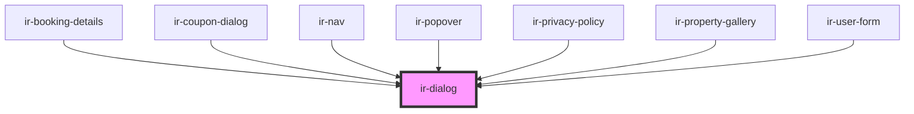

# ir-dialog

<!-- Auto Generated Below -->

## Events

| Event        | Description | Type                   |
| ------------ | ----------- | ---------------------- |
| `openChange` |             | `CustomEvent<boolean>` |

## Methods

### `closeModal() => Promise<void>`

#### Returns

Type: `Promise<void>`

### `openModal() => Promise<void>`

#### Returns

Type: `Promise<void>`

## Dependencies

### Used by

 - [ir-booking-details](../../ir-booking-engine/ir-checkout-page/ir-booking-details)
 - [ir-coupon-dialog](../../ir-booking-engine/ir-booking-page/ir-availibility-header/ir-coupon-dialog)
 - [ir-nav](../../ir-booking-engine/ir-nav)
 - [ir-popover](../ir-popover)
 - [ir-privacy-policy](../../ir-booking-engine/ir-privacy-policy)
 - [ir-property-gallery](../../ir-booking-engine/ir-booking-page/ir-property-gallery)
 - [ir-user-form](../../ir-booking-engine/ir-checkout-page/ir-user-form)

### Graph

```mermaid
graph TD;
  ir-booking-details --> ir-dialog
  ir-coupon-dialog --> ir-dialog
  ir-nav --> ir-dialog
  ir-popover --> ir-dialog
  ir-privacy-policy --> ir-dialog
  ir-property-gallery --> ir-dialog
  ir-user-form --> ir-dialog
  style ir-dialog fill:#f9f,stroke:#333,stroke-width:4px
```

----------------------------------------------

*Built with [StencilJS](https://stenciljs.com/)*
