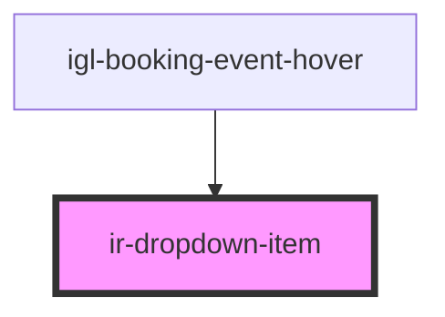

# ir-dropdown-item

<!-- Auto Generated Below -->

## Properties

| Property             | Attribute      | Description                                                                                                     | Type      | Default     |
| -------------------- | -------------- | --------------------------------------------------------------------------------------------------------------- | --------- | ----------- |
| `hidden`             | `hidden`       | When true, visually hide the item (used for filtering).                                                         | `boolean` | `false`     |
| `html_content`       | `html_content` | Optional html_content (when you want rich content); If omitted, the component will render its own slot content. | `string`  | `undefined` |
| `label`              | `label`        | Optional label (falls back to textContent)                                                                      | `string`  | `undefined` |
| `value` _(required)_ | `value`        | Required value for the option                                                                                   | `string`  | `undefined` |

## Events

| Event                    | Description                                                             | Type                            |
| ------------------------ | ----------------------------------------------------------------------- | ------------------------------- |
| `dropdownItemRegister`   | Inform the parent this item exists (parent will index and manage focus) | `CustomEvent<void>`             |
| `dropdownItemSelect`     | Emit when this item is chosen. Parent listens and closes dropdown.      | `CustomEvent<number \| string>` |
| `dropdownItemUnregister` | Inform the parent this item is gone                                     | `CustomEvent<void>`             |

## Methods

### `matchesQuery(query: string) => Promise<boolean>`

#### Parameters

| Name    | Type     | Description |
| ------- | -------- | ----------- |
| `query` | `string` |             |

#### Returns

Type: `Promise<boolean>`

### `setHidden(next: boolean) => Promise<void>`

#### Parameters

| Name   | Type      | Description |
| ------ | --------- | ----------- |
| `next` | `boolean` |             |

#### Returns

Type: `Promise<void>`

## Dependencies

### Used by

 - [igl-booking-event-hover](../../igloo-calendar/igl-booking-event-hover)

### Graph

----------------------------------------------

*Built with [StencilJS](https://stenciljs.com/)*
