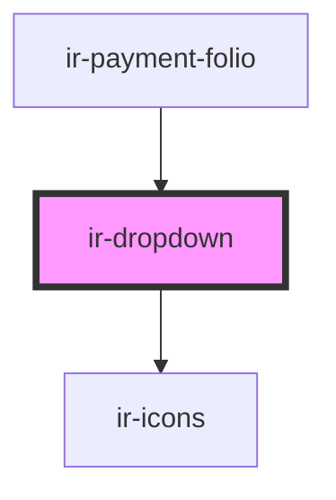

# ir-dropdown

<!-- Auto Generated Below -->

## Properties

| Property   | Attribute  | Description | Type               | Default     |
| ---------- | ---------- | ----------- | ------------------ | ----------- |
| `disabled` | `disabled` |             | `boolean`          | `false`     |
| `value`    | `value`    |             | `number \| string` | `undefined` |

## Events

| Event          | Description                                                                                                             | Type                            |
| -------------- | ----------------------------------------------------------------------------------------------------------------------- | ------------------------------- |
| `optionChange` | Emitted when a user selects an option from the combobox. The event payload contains the selected `DropdownItem` object. | `CustomEvent<number \| string>` |

## Dependencies

### Used by

 - [ir-payment-folio](../../ir-booking-details/ir-payment-details/ir-payment-folio)

### Depends on

- [ir-icons](../ir-icons)

### Graph

----------------------------------------------

*Built with [StencilJS](https://stenciljs.com/)*
