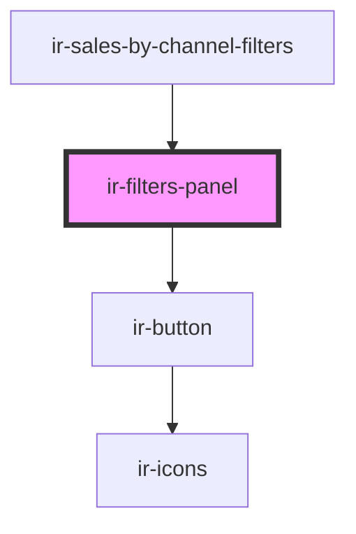

# ir-filters-panel

<!-- Auto Generated Below -->

## Properties

| Property              | Attribute               | Description                                                      | Type                                                                                                                                                                                                                                                                                                                                                                                                                                                                                                                                                                                                                                                                                                                                                                                                                                                                              | Default                       |
| --------------------- | ----------------------- | ---------------------------------------------------------------- | --------------------------------------------------------------------------------------------------------------------------------------------------------------------------------------------------------------------------------------------------------------------------------------------------------------------------------------------------------------------------------------------------------------------------------------------------------------------------------------------------------------------------------------------------------------------------------------------------------------------------------------------------------------------------------------------------------------------------------------------------------------------------------------------------------------------------------------------------------------------------------- | ----------------------------- |
| `actionTestId`        | `action-test-id`        | Optional data test id suffix for default buttons                 | `string`                                                                                                                                                                                                                                                                                                                                                                                                                                                                                                                                                                                                                                                                                                                                                                                                                                                                          | `'filter'`                    |
| `actionsAlign`        | `actions-align`         | Align footer actions                                             | `"center" \| "end" \| "space-around" \| "space-between" \| "start"`                                                                                                                                                                                                                                                                                                                                                                                                                                                                                                                                                                                                                                                                                                                                                                                                               | `'end'`                       |
| `applyLabel`          | `apply-label`           | Apply button copy                                                | `string`                                                                                                                                                                                                                                                                                                                                                                                                                                                                                                                                                                                                                                                                                                                                                                                                                                                                          | `locales.entries.Lcz_Apply`   |
| `cardClass`           | `card-class`            | Optional extra class for the card wrapper                        | `string`                                                                                                                                                                                                                                                                                                                                                                                                                                                                                                                                                                                                                                                                                                                                                                                                                                                                          | `'sales-filters-card'`        |
| `collapseIconClosed`  | `collapse-icon-closed`  | Collapse icon when collapsed                                     | `"print" \| "key" \| "angle-down" \| "clock" \| "check" \| "heart-fill" \| "envelope-circle-check" \| "danger" \| "bell" \| "burger_menu" \| "home" \| "xmark" \| "minus" \| "user" \| "heart" \| "user_group" \| "search" \| "arrow_right" \| "arrow_left" \| "circle_info" \| "calendar" \| "xmark-fill" \| "globe" \| "facebook" \| "twitter" \| "whatsapp" \| "instagram" \| "youtube" \| "angle_left" \| "circle_check" \| "eraser" \| "file" \| "edit" \| "trash" \| "plus" \| "reciept" \| "menu_list" \| "save" \| "credit_card" \| "closed_eye" \| "open_eye" \| "server" \| "double_caret_left" \| "square_plus" \| "angles_left" \| "angle_right" \| "angles_right" \| "outline_user" \| "unlock" \| "circle_plus" \| "arrow-right-from-bracket" \| "note" \| "email" \| "calendar-xmark" \| "arrow-trend-up" \| "hotel" \| "arrow-trend-down" \| "angle-up" \| "ban"` | `'closed_eye'`                |
| `collapseIconOpen`    | `collapse-icon-open`    | Collapse icon when expanded                                      | `"print" \| "key" \| "angle-down" \| "clock" \| "check" \| "heart-fill" \| "envelope-circle-check" \| "danger" \| "bell" \| "burger_menu" \| "home" \| "xmark" \| "minus" \| "user" \| "heart" \| "user_group" \| "search" \| "arrow_right" \| "arrow_left" \| "circle_info" \| "calendar" \| "xmark-fill" \| "globe" \| "facebook" \| "twitter" \| "whatsapp" \| "instagram" \| "youtube" \| "angle_left" \| "circle_check" \| "eraser" \| "file" \| "edit" \| "trash" \| "plus" \| "reciept" \| "menu_list" \| "save" \| "credit_card" \| "closed_eye" \| "open_eye" \| "server" \| "double_caret_left" \| "square_plus" \| "angles_left" \| "angle_right" \| "angles_right" \| "outline_user" \| "unlock" \| "circle_plus" \| "arrow-right-from-bracket" \| "note" \| "email" \| "calendar-xmark" \| "arrow-trend-up" \| "hotel" \| "arrow-trend-down" \| "angle-up" \| "ban"` | `'open_eye'`                  |
| `collapseId`          | `collapse-id`           | Optional custom collapse target id (useful for legacy CSS hooks) | `string`                                                                                                                                                                                                                                                                                                                                                                                                                                                                                                                                                                                                                                                                                                                                                                                                                                                                          | `undefined`                   |
| `collapsed`           | `collapsed`             | Controlled collapse state                                        | `boolean`                                                                                                                                                                                                                                                                                                                                                                                                                                                                                                                                                                                                                                                                                                                                                                                                                                                                         | `undefined`                   |
| `contentClass`        | `content-class`         | Optional extra class for the filters content wrapper             | `string`                                                                                                                                                                                                                                                                                                                                                                                                                                                                                                                                                                                                                                                                                                                                                                                                                                                                          | `undefined`                   |
| `contentGap`          | `content-gap`           | Space between content items                                      | `string`                                                                                                                                                                                                                                                                                                                                                                                                                                                                                                                                                                                                                                                                                                                                                                                                                                                                          | `'0.5rem'`                    |
| `defaultCollapsed`    | `default-collapsed`     | Collapse by default                                              | `boolean`                                                                                                                                                                                                                                                                                                                                                                                                                                                                                                                                                                                                                                                                                                                                                                                                                                                                         | `false`                       |
| `disableApply`        | `disable-apply`         | Disable apply action                                             | `boolean`                                                                                                                                                                                                                                                                                                                                                                                                                                                                                                                                                                                                                                                                                                                                                                                                                                                                         | `false`                       |
| `disableReset`        | `disable-reset`         | Disable reset action                                             | `boolean`                                                                                                                                                                                                                                                                                                                                                                                                                                                                                                                                                                                                                                                                                                                                                                                                                                                                         | `false`                       |
| `filterTitle`         | `filter-title`          | Panel headline text                                              | `string`                                                                                                                                                                                                                                                                                                                                                                                                                                                                                                                                                                                                                                                                                                                                                                                                                                                                          | `locales.entries.Lcz_Filters` |
| `headerClass`         | `header-class`          | Optional extra class for the header row                          | `string`                                                                                                                                                                                                                                                                                                                                                                                                                                                                                                                                                                                                                                                                                                                                                                                                                                                                          | `undefined`                   |
| `hideDefaultActions`  | `hide-default-actions`  | Hide the default footer actions                                  | `boolean`                                                                                                                                                                                                                                                                                                                                                                                                                                                                                                                                                                                                                                                                                                                                                                                                                                                                         | `false`                       |
| `isApplyLoading`      | `is-apply-loading`      | Show loader inside apply button                                  | `boolean`                                                                                                                                                                                                                                                                                                                                                                                                                                                                                                                                                                                                                                                                                                                                                                                                                                                                         | `false`                       |
| `panelClass`          | `panel-class`           | Optional extra class for the outer wrapper                       | `string`                                                                                                                                                                                                                                                                                                                                                                                                                                                                                                                                                                                                                                                                                                                                                                                                                                                                          | `undefined`                   |
| `persistentOnDesktop` | `persistent-on-desktop` | Keep content expanded on desktop and hide the collapse toggle    | `boolean`                                                                                                                                                                                                                                                                                                                                                                                                                                                                                                                                                                                                                                                                                                                                                                                                                                                                         | `true`                        |
| `resetLabel`          | `reset-label`           | Reset button copy                                                | `string`                                                                                                                                                                                                                                                                                                                                                                                                                                                                                                                                                                                                                                                                                                                                                                                                                                                                          | `locales.entries.Lcz_Reset`   |
| `showCollapseButton`  | `show-collapse-button`  | Show collapse toggle button                                      | `boolean`                                                                                                                                                                                                                                                                                                                                                                                                                                                                                                                                                                                                                                                                                                                                                                                                                                                                         | `true`                        |

## Events

| Event            | Description | Type                                   |
| ---------------- | ----------- | -------------------------------------- |
| `irFilterApply`  |             | `CustomEvent<void>`                    |
| `irFilterReset`  |             | `CustomEvent<void>`                    |
| `irFilterToggle` |             | `CustomEvent<{ collapsed: boolean; }>` |

## Dependencies

### Used by

 - [ir-sales-by-channel-filters](../../ir-sales-by-channel/ir-sales-by-channel-filters)

### Depends on

- [ir-button](../ir-button)

### Graph

----------------------------------------------

*Built with [StencilJS](https://stenciljs.com/)*
