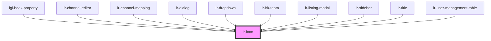

# ir-icon

<!-- Auto Generated Below -->

## Properties

| Property | Attribute | Description | Type                              | Default      |
| -------- | --------- | ----------- | --------------------------------- | ------------ |
| `icon`   | `icon`    |             | `string`                          | `'ft-check'` |
| `type`   | `type`    |             | `"button" \| "reset" \| "submit"` | `'button'`   |

## Events

| Event              | Description | Type               |
| ------------------ | ----------- | ------------------ |
| `iconClickHandler` |             | `CustomEvent<any>` |

## Dependencies

### Used by

 - [igl-book-property](../../igloo-calendar/igl-book-property)
 - [ir-channel-editor](../../ir-channel/ir-channel-editor)
 - [ir-channel-mapping](../../ir-channel/ir-channel-mapping)
 - [ir-dialog](../ir-dialog)
 - [ir-dropdown](../ir-dropdown)
 - [ir-hk-team](../../ir-housekeeping/ir-hk-team)
 - [ir-listing-modal](../../ir-booking-listing/ir-listing-modal)
 - [ir-sidebar](../ir-sidebar)
 - [ir-title](../../ir-title)
 - [ir-user-management-table](../../ir-user-management/ir-user-management-table)

### Graph

----------------------------------------------

*Built with [StencilJS](https://stenciljs.com/)*
