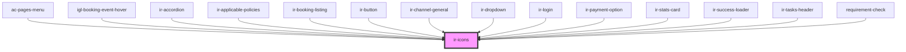

# ir-icons

<!-- Auto Generated Below -->


## Properties

| Property       | Attribute        | Description                                                                                                                    | Type                                                                                                                                                                                                                                                                                                                                                                                                                                                                                                                                                                                                                                                                                                                                                                                                                                                                              | Default     |
| -------------- | ---------------- | ------------------------------------------------------------------------------------------------------------------------------ | --------------------------------------------------------------------------------------------------------------------------------------------------------------------------------------------------------------------------------------------------------------------------------------------------------------------------------------------------------------------------------------------------------------------------------------------------------------------------------------------------------------------------------------------------------------------------------------------------------------------------------------------------------------------------------------------------------------------------------------------------------------------------------------------------------------------------------------------------------------------------------- | ----------- |
| `color`        | `color`          | Sets the `color` attribute on the `<svg>` element. Accepts any valid CSS color string.                                         | `string`                                                                                                                                                                                                                                                                                                                                                                                                                                                                                                                                                                                                                                                                                                                                                                                                                                                                          | `undefined` |
| `name`         | `name`           | The name of the icon to render. Must match a key from the imported `icons` map.  Example: ```tsx <ir-icons name="check" /> ``` | `"angle-down" \| "clock" \| "check" \| "heart-fill" \| "envelope-circle-check" \| "danger" \| "bell" \| "burger_menu" \| "home" \| "xmark" \| "minus" \| "user" \| "heart" \| "user_group" \| "search" \| "arrow_right" \| "arrow_left" \| "circle_info" \| "calendar" \| "xmark-fill" \| "globe" \| "facebook" \| "twitter" \| "whatsapp" \| "instagram" \| "youtube" \| "angle_left" \| "circle_check" \| "eraser" \| "file" \| "edit" \| "trash" \| "plus" \| "reciept" \| "print" \| "menu_list" \| "save" \| "credit_card" \| "closed_eye" \| "open_eye" \| "server" \| "double_caret_left" \| "square_plus" \| "angles_left" \| "angle_right" \| "angles_right" \| "outline_user" \| "key" \| "unlock" \| "circle_plus" \| "arrow-right-from-bracket" \| "note" \| "email" \| "calendar-xmark" \| "arrow-trend-up" \| "hotel" \| "arrow-trend-down" \| "angle-up" \| "ban"` | `undefined` |
| `svgClassName` | `svg-class-name` | Additional CSS class applied to the `<svg>` element. Can be used for sizing, positioning, etc.                                 | `string`                                                                                                                                                                                                                                                                                                                                                                                                                                                                                                                                                                                                                                                                                                                                                                                                                                                                          | `undefined` |


## Dependencies

### Used by

 - [ac-pages-menu](../../ac-pages-menu)
 - [igl-booking-event-hover](../../igloo-calendar/igl-booking-event-hover)
 - [ir-accordion](../ir-accordion)
 - [ir-applicable-policies](../../ir-booking-details/ir-payment-details/ir-applicable-policies)
 - [ir-booking-listing](../../ir-booking-listing)
 - [ir-button](../ir-button)
 - [ir-channel-general](../../ir-channel/ir-channel-general)
 - [ir-dropdown](../ir-dropdown)
 - [ir-login](../../ir-login)
 - [ir-payment-option](../../ir-payment-option)
 - [ir-stats-card](../ir-stats-card)
 - [ir-success-loader](../ir-success-loader)
 - [ir-tasks-header](../../ir-housekeeping/ir-hk-tasks/ir-tasks-header)
 - [requirement-check](../../ir-password-validator/requirement-check)

### Graph


----------------------------------------------

*Built with [StencilJS](https://stenciljs.com/)*
