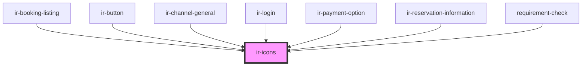

# ir-icons

<!-- Auto Generated Below -->

## Properties

| Property       | Attribute        | Description | Type                                                                                                                                                                                                                                                                                                                                                                                                                                                                                                                                                                                                                                                                                                                                                              | Default     |
| -------------- | ---------------- | ----------- | ----------------------------------------------------------------------------------------------------------------------------------------------------------------------------------------------------------------------------------------------------------------------------------------------------------------------------------------------------------------------------------------------------------------------------------------------------------------------------------------------------------------------------------------------------------------------------------------------------------------------------------------------------------------------------------------------------------------------------------------------------------------- | ----------- |
| `color`        | `color`          |             | `string`                                                                                                                                                                                                                                                                                                                                                                                                                                                                                                                                                                                                                                                                                                                                                          | `undefined` |
| `name`         | `name`           |             | `"print" \| "key" \| "search" \| "email" \| "save" \| "check" \| "calendar" \| "note" \| "user" \| "file" \| "server" \| "danger" \| "clock" \| "heart-fill" \| "envelope-circle-check" \| "bell" \| "burger_menu" \| "home" \| "xmark" \| "minus" \| "heart" \| "user_group" \| "arrow_right" \| "arrow_left" \| "circle_info" \| "xmark-fill" \| "globe" \| "facebook" \| "twitter" \| "whatsapp" \| "instagram" \| "youtube" \| "angle_left" \| "circle_check" \| "eraser" \| "edit" \| "trash" \| "plus" \| "reciept" \| "menu_list" \| "credit_card" \| "closed_eye" \| "open_eye" \| "double_caret_left" \| "square_plus" \| "angles_left" \| "angle_right" \| "angles_right" \| "outline_user" \| "unlock" \| "circle_plus" \| "arrow-right-from-bracket"` | `undefined` |
| `svgClassName` | `svg-class-name` |             | `string`                                                                                                                                                                                                                                                                                                                                                                                                                                                                                                                                                                                                                                                                                                                                                          | `undefined` |

## Dependencies

### Used by

 - [ir-booking-listing](../../ir-booking-listing)
 - [ir-button](../ir-button)
 - [ir-channel-general](../../ir-channel/ir-channel-general)
 - [ir-login](../../ir-login)
 - [ir-payment-option](../../ir-payment-option)
 - [ir-reservation-information](../../ir-booking-details/ir-reservation-information)
 - [requirement-check](../../ir-password-validator/requirement-check)

### Graph

----------------------------------------------

*Built with [StencilJS](https://stenciljs.com/)*
