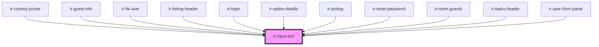

# ir-input-text

<!-- Auto Generated Below -->

## Properties

| Property           | Attribute           | Description                                                            | Type                                                                                                                                                                                                                                                        | Default     |
| ------------------ | ------------------- | ---------------------------------------------------------------------- | ----------------------------------------------------------------------------------------------------------------------------------------------------------------------------------------------------------------------------------------------------------- | ----------- |
| `asyncParse`       | `async-parse`       | A Zod parse type for validating the input                              | `boolean`                                                                                                                                                                                                                                                   | `undefined` |
| `autoComplete`     | `auto-complete`     | Autocomplete behavior for the input (e.g., 'on', 'off', 'email', etc.) | `string`                                                                                                                                                                                                                                                    | `undefined` |
| `autoValidate`     | `auto-validate`     | Whether the input should auto-validate                                 | `boolean`                                                                                                                                                                                                                                                   | `true`      |
| `clearBaseStyles`  | `clear-base-styles` | To clear all the Input base styling                                    | `boolean`                                                                                                                                                                                                                                                   | `undefined` |
| `disabled`         | `disabled`          | Whether the input is disabled                                          | `boolean`                                                                                                                                                                                                                                                   | `false`     |
| `error`            | `error`             | Whether the input has an error                                         | `boolean`                                                                                                                                                                                                                                                   | `false`     |
| `errorMessage`     | `error-message`     | To clear all the Input base styling                                    | `string`                                                                                                                                                                                                                                                    | `undefined` |
| `inputForcedStyle` | --                  | Forcing css style to the input                                         | `{ [key: string]: string; }`                                                                                                                                                                                                                                | `undefined` |
| `inputStyle`       | `input-style`       | Whether to apply default input styling                                 | `boolean`                                                                                                                                                                                                                                                   | `true`      |
| `inputStyles`      | `input-styles`      | Additional inline styles for the input                                 | `string`                                                                                                                                                                                                                                                    | `''`        |
| `label`            | `label`             | Label text for the input                                               | `string`                                                                                                                                                                                                                                                    | `undefined` |
| `labelBackground`  | `label-background`  | Background color of the label                                          | `"danger" \| "dark" \| "info" \| "light" \| "primary" \| "secondary" \| "success" \| "warning"`                                                                                                                                                             | `null`      |
| `labelBorder`      | `label-border`      | Border color/style of the label                                        | `"danger" \| "dark" \| "info" \| "light" \| "none" \| "primary" \| "secondary" \| "success" \| "theme" \| "warning"`                                                                                                                                        | `'theme'`   |
| `labelColor`       | `label-color`       | Text color of the label                                                | `"danger" \| "dark" \| "info" \| "light" \| "primary" \| "secondary" \| "success" \| "warning"`                                                                                                                                                             | `'dark'`    |
| `labelPosition`    | `label-position`    | Position of the label: left, right, or center                          | `"center" \| "left" \| "right"`                                                                                                                                                                                                                             | `'left'`    |
| `labelWidth`       | `label-width`       | Label width as a fraction of 12 columns (1-11)                         | `1 \| 10 \| 11 \| 2 \| 3 \| 4 \| 5 \| 6 \| 7 \| 8 \| 9`                                                                                                                                                                                                     | `3`         |
| `mask`             | `mask`              | Mask for the input field (optional)                                    | `string \| RegExp \| NumberConstructor \| DateConstructor \| FactoryOpts \| Masked<any> \| ((value: string, masked: Masked<any>) => boolean) \| DynamicMaskType`                                                                                            | `undefined` |
| `maxLength`        | `max-length`        | Input max character length                                             | `number`                                                                                                                                                                                                                                                    | `undefined` |
| `name`             | `name`              | Name attribute for the input field                                     | `string`                                                                                                                                                                                                                                                    | `undefined` |
| `placeholder`      | `placeholder`       | Placeholder text for the input                                         | `string`                                                                                                                                                                                                                                                    | `undefined` |
| `readonly`         | `readonly`          | Whether the input field is read-only                                   | `boolean`                                                                                                                                                                                                                                                   | `false`     |
| `required`         | `required`          | Whether the input field is required                                    | `boolean`                                                                                                                                                                                                                                                   | `undefined` |
| `submitted`        | `submitted`         | Whether the form has been submitted                                    | `boolean`                                                                                                                                                                                                                                                   | `false`     |
| `testId`           | `test-id`           | Input id for testing purposes                                          | `string`                                                                                                                                                                                                                                                    | `undefined` |
| `textSize`         | `text-size`         | Text size inside the input field                                       | `"lg" \| "md" \| "sm"`                                                                                                                                                                                                                                      | `'md'`      |
| `type`             | `type`              | Input type (e.g., text, password, email)                               | `"number" \| "color" \| "button" \| "time" \| "image" \| "text" \| "hidden" \| "search" \| "date" \| "email" \| "url" \| "week" \| "month" \| "password" \| "reset" \| "file" \| "range" \| "submit" \| "tel" \| "datetime-local" \| "checkbox" \| "radio"` | `'text'`    |
| `value`            | `value`             | Value of the input field                                               | `string`                                                                                                                                                                                                                                                    | `undefined` |
| `variant`          | `variant`           | Variant of the input: default or icon                                  | `"default" \| "icon"`                                                                                                                                                                                                                                       | `'default'` |
| `wrapKey`          | `wrap-key`          | Key to wrap the value (e.g., 'price' or 'cost')                        | `string`                                                                                                                                                                                                                                                    | `undefined` |
| `zod`              | --                  | A Zod schema for validating the input                                  | `ZodType<any, any, any>`                                                                                                                                                                                                                                    | `undefined` |

## Events

| Event        | Description | Type                      |
| ------------ | ----------- | ------------------------- |
| `inputBlur`  |             | `CustomEvent<FocusEvent>` |
| `inputFocus` |             | `CustomEvent<FocusEvent>` |
| `textChange` |             | `CustomEvent<any>`        |

## Dependencies

### Used by

 - [ir-country-picker](../ir-country-picker)
 - [ir-guest-info](../../ir-guest-info)
 - [ir-hk-user](../../ir-housekeeping/ir-hk-user)
 - [ir-listing-header](../../ir-booking-listing/ir-listing-header)
 - [ir-login](../../ir-login)
 - [ir-option-details](../../ir-payment-option/ir-option-details)
 - [ir-pickup](../../ir-booking-details/ir-pickup)
 - [ir-reset-password](../../ir-reset-password)
 - [ir-room-guests](../../ir-booking-details/ir-room-guests)
 - [ir-tasks-header](../../ir-housekeeping/ir-hk-tasks/ir-tasks-header)
 - [ir-user-form-panel](../../ir-user-management/ir-user-form-panel)

### Graph

----------------------------------------------

*Built with [StencilJS](https://stenciljs.com/)*
