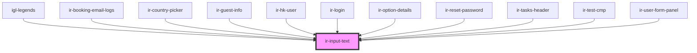

# ir-input-text

<!-- Auto Generated Below -->

## Properties

| Property                  | Attribute                   | Description                                                                                                                                                                                                                                     | Type                                                                                                                                                                                                                                                        | Default     |
| ------------------------- | --------------------------- | ----------------------------------------------------------------------------------------------------------------------------------------------------------------------------------------------------------------------------------------------- | ----------------------------------------------------------------------------------------------------------------------------------------------------------------------------------------------------------------------------------------------------------- | ----------- |
| `asyncParse`              | `async-parse`               | A Zod parse type for validating the input                                                                                                                                                                                                       | `boolean`                                                                                                                                                                                                                                                   | `undefined` |
| `autoComplete`            | `auto-complete`             | Autocomplete behavior for the input (e.g., 'on', 'off', 'email', etc.)                                                                                                                                                                          | `string`                                                                                                                                                                                                                                                    | `undefined` |
| `autoValidate`            | `auto-validate`             | Whether the input should auto-validate                                                                                                                                                                                                          | `boolean`                                                                                                                                                                                                                                                   | `true`      |
| `clearBaseStyles`         | `clear-base-styles`         | To clear all the Input base styling                                                                                                                                                                                                             | `boolean`                                                                                                                                                                                                                                                   | `undefined` |
| `disabled`                | `disabled`                  | Whether the input is disabled                                                                                                                                                                                                                   | `boolean`                                                                                                                                                                                                                                                   | `false`     |
| `error`                   | `error`                     | Whether the input has an error                                                                                                                                                                                                                  | `boolean`                                                                                                                                                                                                                                                   | `false`     |
| `errorMessage`            | `error-message`             | To clear all the Input base styling                                                                                                                                                                                                             | `string`                                                                                                                                                                                                                                                    | `undefined` |
| `inputContainerStyle`     | --                          | Forcing css style to the input container                                                                                                                                                                                                        | `{ [key: string]: string; }`                                                                                                                                                                                                                                | `undefined` |
| `inputForcedStyle`        | --                          | Forcing css style to the input                                                                                                                                                                                                                  | `{ [key: string]: string; }`                                                                                                                                                                                                                                | `undefined` |
| `inputStyle`              | `input-style`               | Whether to apply default input styling                                                                                                                                                                                                          | `boolean`                                                                                                                                                                                                                                                   | `true`      |
| `inputStyles`             | `input-styles`              | Additional inline styles for the input                                                                                                                                                                                                          | `string`                                                                                                                                                                                                                                                    | `''`        |
| `label`                   | `label`                     | Label text for the input                                                                                                                                                                                                                        | `string`                                                                                                                                                                                                                                                    | `undefined` |
| `labelBackground`         | `label-background`          | Background color of the label                                                                                                                                                                                                                   | `"danger" \| "dark" \| "info" \| "light" \| "primary" \| "secondary" \| "success" \| "warning"`                                                                                                                                                             | `null`      |
| `labelBorder`             | `label-border`              | Border color/style of the label                                                                                                                                                                                                                 | `"danger" \| "dark" \| "info" \| "light" \| "none" \| "primary" \| "secondary" \| "success" \| "theme" \| "warning"`                                                                                                                                        | `'theme'`   |
| `labelColor`              | `label-color`               | Text color of the label                                                                                                                                                                                                                         | `"danger" \| "dark" \| "info" \| "light" \| "primary" \| "secondary" \| "success" \| "warning"`                                                                                                                                                             | `'dark'`    |
| `labelContainerClassname` | `label-container-classname` | Extra class names applied to the label container (
) that wraps the <label>. Use this to control label width, alignment, spacing, or visibility at different breakpoints. Example: "min-w-120 text-nowrap pe-2" | `string`                                                                                                                                                                                                                                                    | `undefined` |
| `labelPosition`           | `label-position`            | Position of the label: left, right, or center                                                                                                                                                                                                   | `"center" \| "left" \| "right" \| "top"`                                                                                                                                                                                                                    | `'left'`    |
| `labelWidth`              | `label-width`               | Label width as a fraction of 12 columns (1-11)                                                                                                                                                                                                  | `1 \| 10 \| 11 \| 2 \| 3 \| 4 \| 5 \| 6 \| 7 \| 8 \| 9`                                                                                                                                                                                                     | `3`         |
| `mask`                    | `mask`                      | Mask for the input field (optional)                                                                                                                                                                                                             | `string \| RegExp \| DateConstructor \| NumberConstructor \| Masked<any> \| FactoryOpts \| ((value: string, masked: Masked<any>) => boolean) \| DynamicMaskType`                                                                                            | `undefined` |
| `maxLength`               | `max-length`                | Input max character length                                                                                                                                                                                                                      | `number`                                                                                                                                                                                                                                                    | `undefined` |
| `name`                    | `name`                      | Name attribute for the input field                                                                                                                                                                                                              | `string`                                                                                                                                                                                                                                                    | `undefined` |
| `placeholder`             | `placeholder`               | Placeholder text for the input                                                                                                                                                                                                                  | `string`                                                                                                                                                                                                                                                    | `undefined` |
| `readonly`                | `readonly`                  | Whether the input field is read-only                                                                                                                                                                                                            | `boolean`                                                                                                                                                                                                                                                   | `false`     |
| `required`                | `required`                  | Whether the input field is required                                                                                                                                                                                                             | `boolean`                                                                                                                                                                                                                                                   | `undefined` |
| `submitted`               | `submitted`                 | Whether the form has been submitted                                                                                                                                                                                                             | `boolean`                                                                                                                                                                                                                                                   | `false`     |
| `testId`                  | `test-id`                   | Input id for testing purposes                                                                                                                                                                                                                   | `string`                                                                                                                                                                                                                                                    | `undefined` |
| `textSize`                | `text-size`                 | Text size inside the input field                                                                                                                                                                                                                | `"lg" \| "md" \| "sm"`                                                                                                                                                                                                                                      | `'md'`      |
| `type`                    | `type`                      | Input type (e.g., text, password, email)                                                                                                                                                                                                        | `"number" \| "search" \| "file" \| "email" \| "date" \| "password" \| "month" \| "week" \| "text" \| "button" \| "time" \| "reset" \| "color" \| "url" \| "hidden" \| "image" \| "submit" \| "datetime-local" \| "tel" \| "checkbox" \| "range" \| "radio"` | `'text'`    |
| `value`                   | `value`                     | Value of the input field                                                                                                                                                                                                                        | `string`                                                                                                                                                                                                                                                    | `undefined` |
| `variant`                 | `variant`                   | Variant of the input: default or icon or floating-label                                                                                                                                                                                         | `"default" \| "floating-label" \| "icon"`                                                                                                                                                                                                                   | `'default'` |
| `wrapKey`                 | `wrap-key`                  | Key to wrap the value (e.g., 'price' or 'cost')                                                                                                                                                                                                 | `string`                                                                                                                                                                                                                                                    | `undefined` |
| `zod`                     | --                          | A Zod schema for validating the input                                                                                                                                                                                                           | `ZodType<any, any, any>`                                                                                                                                                                                                                                    | `undefined` |

## Events

| Event        | Description | Type                      |
| ------------ | ----------- | ------------------------- |
| `inputBlur`  |             | `CustomEvent<FocusEvent>` |
| `inputFocus` |             | `CustomEvent<FocusEvent>` |
| `textChange` |             | `CustomEvent<any>`        |

## Shadow Parts

| Part                 | Description |
| -------------------- | ----------- |
| `"error-message"`    |             |
| `"form-group"`       |             |
| `"input"`            |             |
| `"label"`            |             |
| `"prefix-container"` |             |
| `"suffix-container"` |             |

## CSS Custom Properties

| Name                                                    | Description                                                  |
| ------------------------------------------------------- | ------------------------------------------------------------ |
| `--blue`                                                | Legacy alias for --ir-primary.                               |
| `--ir-bg`                                               | Base background of the control.                              |
| `--ir-border`                                           | Generic border color used across the component.              |
| `--ir-danger`                                           | Error color for borders and text.                            |
| `--ir-disabled-fg`                                      | Text/icon color when disabled.                               |
| `--ir-floating-input-affix-color`                       | Color for prefix/suffix icons/text.                          |
| `--ir-floating-input-affix-size`                        | Size for prefix/suffix slotted icons/elements.               |
| `--ir-floating-input-border`                            | Outline/border color of the floating group.                  |
| `--ir-floating-input-border-radius`                     | Corner radius for the outlined group and input.              |
| `--ir-floating-input-font-size`                         | Font size of the input text.                                 |
| `--ir-floating-input-height`                            | Fixed height for the input element.                          |
| `--ir-floating-input-line-height`                       | Line-height of the input text.                               |
| `--ir-floating-input-padding-x`                         | Horizontal padding inside the input.                         |
| `--ir-floating-input-padding-x-with-affix`              | Horizontal padding when a prefix/suffix is present.          |
| `--ir-floating-input-padding-y`                         | Vertical padding inside the input.                           |
| `--ir-floating-label-bg`                                | Background behind the floated label “chip”.                  |
| `--ir-floating-label-fg`                                | Resting label color.                                         |
| `--ir-floating-label-fg-focus`                          | Floated/active label color.                                  |
| `--ir-floating-label-float-translateY`                  | translateY used when label floats (relative to its top=0).   |
| `--ir-floating-label-resting-offset-inline`             | Inline offset for the resting label (LTR=left, RTL=right).   |
| `--ir-floating-label-resting-offset-inline-with-prefix` | Inline offset for the label when a prefix exists.            |
| `--ir-floating-label-scale`                             | Scale applied to the label when floated.                     |
| `--ir-focus-border-color`                               | Border color applied on focus.                               |
| `--ir-focus-ring`                                       | Box-shadow used on focus (set to `none` to disable).         |
| `--ir-input-color`                                      | Text color inside the input.                                 |
| `--ir-placeholder-color`                                | Placeholder color for empty state (when not using floating). |
| `--ir-primary`                                          | Accent color used for focus outline and active label.        |
| `--ir-readonly-bg`                                      | Background for readonly fields.                              |
| `--red`                                                 | Legacy alias for --ir-danger.                                |

## Dependencies

### Used by

 - [igl-legends](../../igloo-calendar/igl-legends)
 - [ir-booking-email-logs](../../ir-booking-email-logs)
 - [ir-country-picker](../ir-country-picker)
 - [ir-guest-info](../../ir-guest-info)
 - [ir-hk-user](../../ir-housekeeping/ir-hk-user)
 - [ir-login](../../ir-login)
 - [ir-option-details](../../ir-payment-option/ir-option-details)
 - [ir-reset-password](../../ir-reset-password)
 - [ir-tasks-header](../../ir-housekeeping/ir-hk-tasks/ir-tasks-header)
 - [ir-test-cmp](../../ir-test-cmp)
 - [ir-user-form-panel](../../ir-user-management/ir-user-form-panel)

### Graph

----------------------------------------------

*Built with [StencilJS](https://stenciljs.com/)*
