# ir-custom-input

<!-- Auto Generated Below -->

## Properties

| Property             | Attribute              | Description                                                                                                                                                                                                                                                                            | Type                                                                                                                | Default     |
| -------------------- | ---------------------- | -------------------------------------------------------------------------------------------------------------------------------------------------------------------------------------------------------------------------------------------------------------------------------------- | ------------------------------------------------------------------------------------------------------------------- | ----------- |
| `appearance`         | `appearance`           | The input's visual appearance.                                                                                                                                                                                                                                                         | `"filled" \| "filled-outlined" \| "outlined"`                                                                       | `undefined` |
| `autocapitalize`     | `autocapitalize`       | Controls whether and how text input is automatically capitalized as it is entered by the user.                                                                                                                                                                                         | `"characters" \| "none" \| "off" \| "on" \| "sentences" \| "words"`                                                 | `undefined` |
| `autocomplete`       | `autocomplete`         | Specifies what permission the browser has to provide assistance in filling out form field values. Refer to [this page on MDN](https://developer.mozilla.org/en-US/docs/Web/HTML/Attributes/autocomplete) for available values.                                                         | `string`                                                                                                            | `undefined` |
| `autocorrect`        | `autocorrect`          | Indicates whether the browser's autocorrect feature is on or off.                                                                                                                                                                                                                      | `"off" \| "on"`                                                                                                     | `undefined` |
| `autofocus`          | `autofocus`            | Indicates that the input should receive focus on page load.                                                                                                                                                                                                                            | `boolean`                                                                                                           | `undefined` |
| `defaultValue`       | `default-value`        | The default value of the form control. Primarily used for resetting the form control.                                                                                                                                                                                                  | `string`                                                                                                            | `undefined` |
| `disabled`           | `disabled`             | Disables the input.                                                                                                                                                                                                                                                                    | `boolean`                                                                                                           | `undefined` |
| `enterkeyhint`       | `enterkeyhint`         | Used to customize the label or icon of the Enter key on virtual keyboards.                                                                                                                                                                                                             | `"done" \| "enter" \| "go" \| "next" \| "previous" \| "search" \| "send"`                                           | `undefined` |
| `form`               | --                     | By default, form controls are associated with the nearest containing `<form>` element. This attribute allows you to place the form control outside of a form and associate it with the form that has this `id`. The form must be in the same document or shadow root for this to work. | `null`                                                                                                              | `undefined` |
| `hint`               | `hint`                 | The input's hint. If you need to display HTML, use the `hint` slot instead.                                                                                                                                                                                                            | `string`                                                                                                            | `undefined` |
| `inputClass`         | `input-class`          | Custom CSS classes applied to the inner `<wa-input>` element.  You can also target the exposed parts `::part(input)` and `::part(base)` for deeper styling of the native input and container.                                                                                          | `string`                                                                                                            | `undefined` |
| `inputmode`          | `inputmode`            | Tells the browser what type of data will be entered by the user, allowing it to display the appropriate virtual keyboard on supportive devices.                                                                                                                                        | `"decimal" \| "email" \| "none" \| "numeric" \| "search" \| "tel" \| "text" \| "url"`                               | `undefined` |
| `label`              | `label`                | The input's label. If you need to display HTML, use the `label` slot instead.                                                                                                                                                                                                          | `string`                                                                                                            | `undefined` |
| `mask`               | `mask`                 | Mask for the input field (optional)                                                                                                                                                                                                                                                    | `MaskConfig<"date" \| "time" \| "price" \| "url"> \| FactoryArg`                                                    | `undefined` |
| `max`                | `max`                  | The input's maximum value. Only applies to date and number input types.                                                                                                                                                                                                                | `number \| string`                                                                                                  | `undefined` |
| `maxlength`          | `maxlength`            | The maximum length of input that will be considered valid.                                                                                                                                                                                                                             | `number`                                                                                                            | `undefined` |
| `min`                | `min`                  | The input's minimum value. Only applies to date and number input types.                                                                                                                                                                                                                | `number \| string`                                                                                                  | `undefined` |
| `minlength`          | `minlength`            | The minimum length of input that will be considered valid.                                                                                                                                                                                                                             | `number`                                                                                                            | `undefined` |
| `passwordToggle`     | `password-toggle`      | Adds a button to toggle the password's visibility. Only applies to password types.                                                                                                                                                                                                     | `boolean`                                                                                                           | `undefined` |
| `passwordVisible`    | `password-visible`     | Determines whether or not the password is currently visible. Only applies to password input types.                                                                                                                                                                                     | `boolean`                                                                                                           | `undefined` |
| `pattern`            | `pattern`              | A regular expression pattern to validate input against.                                                                                                                                                                                                                                | `string`                                                                                                            | `undefined` |
| `pill`               | `pill`                 | Draws a pill-style input with rounded edges.                                                                                                                                                                                                                                           | `boolean`                                                                                                           | `undefined` |
| `placeholder`        | `placeholder`          | Placeholder text to show as a hint when the input is empty.                                                                                                                                                                                                                            | `string`                                                                                                            | `undefined` |
| `readonly`           | `readonly`             | Makes the input readonly.                                                                                                                                                                                                                                                              | `boolean`                                                                                                           | `undefined` |
| `required`           | `required`             | Makes the input a required field.                                                                                                                                                                                                                                                      | `boolean`                                                                                                           | `undefined` |
| `returnMaskedValue`  | `return-masked-value`  |                                                                                                                                                                                                                                                                                        | `boolean`                                                                                                           | `false`     |
| `size`               | `size`                 | The input's size.                                                                                                                                                                                                                                                                      | `"large" \| "medium" \| "small"`                                                                                    | `'small'`   |
| `spellcheck`         | `spellcheck`           | Enables spell checking on the input.                                                                                                                                                                                                                                                   | `boolean`                                                                                                           | `undefined` |
| `step`               | `step`                 | Specifies the granularity that the value must adhere to, or the special value `any` which means no stepping is implied, allowing any numeric value. Only applies to date and number input types.                                                                                       | `"any" \| number`                                                                                                   | `undefined` |
| `type`               | `type`                 | The type of input. Works the same as a native `<input>` element, but only a subset of types are supported. Defaults to `text`.                                                                                                                                                         | `"date" \| "datetime-local" \| "email" \| "number" \| "password" \| "search" \| "tel" \| "text" \| "time" \| "url"` | `'text'`    |
| `value`              | `value`                | The value of the input.                                                                                                                                                                                                                                                                | `string`                                                                                                            | `''`        |
| `withClear`          | `with-clear`           | Adds a clear button when the input is not empty.                                                                                                                                                                                                                                       | `boolean`                                                                                                           | `undefined` |
| `withHint`           | `with-hint`            | Used for SSR. Will determine if the SSRed component will have the hint slot rendered on initial paint.                                                                                                                                                                                 | `boolean`                                                                                                           | `undefined` |
| `withLabel`          | `with-label`           | Used for SSR. Will determine if the SSRed component will have the label slot rendered on initial paint.                                                                                                                                                                                | `boolean`                                                                                                           | `undefined` |
| `withoutSpinButtons` | `without-spin-buttons` | Hides the browser's built-in increment/decrement spin buttons for number inputs.                                                                                                                                                                                                       | `boolean`                                                                                                           | `undefined` |

## Events

| Event         | Description | Type                  |
| ------------- | ----------- | --------------------- |
| `input-blur`  |             | `CustomEvent<void>`   |
| `inputFocus`  |             | `CustomEvent<void>`   |
| `text-change` |             | `CustomEvent<string>` |

## Dependencies

### Used by

 - [igl-application-info](../../igloo-calendar/igl-book-property/igl-booking-form/igl-application-info)
 - [igl-property-booked-by](../../igloo-calendar/igl-book-property/igl-booking-form/igl-property-booked-by)
 - [igl-rate-plan](../../igloo-calendar/igl-book-property/igl-booking-overview-page/igl-room-type/igl-rate-plan)
 - [ir-arrivals-filters](../../ir-arrivals/ir-arrivals-filters)
 - [ir-booking-company-form](../../ir-booking-company-dialog/ir-booking-company-form)
 - [ir-custom-date-picker](../../ir-custom-date-picker)
 - [ir-departures-filter](../../ir-departures/ir-departures-filter)
 - [ir-extra-service-config-form](../../ir-booking-details/ir-extra-services/ir-extra-service-config/ir-extra-service-config-form)
 - [ir-guest-info-form](../../ir-guest-info/ir-guest-info-form)
 - [ir-listing-header](../../ir-booking-listing/ir-listing-header)
 - [ir-payment-folio-form](../../ir-booking-details/ir-payment-details/ir-payment-folio/ir-payment-folio-form)
 - [ir-pickup-form](../../ir-booking-details/ir-pickup/ir-pickup-form)
 - [ir-room-guests-form](../../ir-booking-details/ir-room-guests/ir-room-guests-form)
 - [ir-secure-tasks](../../ir-secure-tasks)

### Graph

```mermaid
graph TD;
  igl-application-info --> ir-input
  igl-property-booked-by --> ir-input
  igl-rate-plan --> ir-input
  ir-arrivals-filters --> ir-input
  ir-booking-company-form --> ir-input
  ir-custom-date-picker --> ir-input
  ir-departures-filter --> ir-input
  ir-extra-service-config-form --> ir-input
  ir-guest-info-form --> ir-input
  ir-listing-header --> ir-input
  ir-payment-folio-form --> ir-input
  ir-pickup-form --> ir-input
  ir-room-guests-form --> ir-input
  ir-secure-tasks --> ir-input
  style ir-input fill:#f9f,stroke:#333,stroke-width:4px
```

----------------------------------------------

*Built with [StencilJS](https://stenciljs.com/)*
