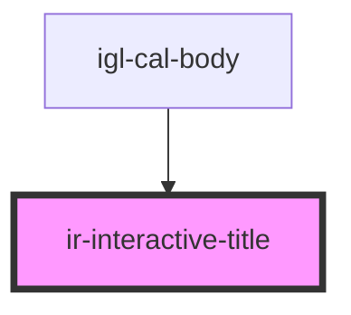

# ir-interactive-title

<!-- Auto Generated Below -->

## Properties

| Property        | Attribute         | Description                                                                                  | Type      | Default     |
| --------------- | ----------------- | -------------------------------------------------------------------------------------------- | --------- | ----------- |
| `broomTooltip`  | `broom-tooltip`   | The message shown when hovering over the broom svg if provided.                              | `string`  | `undefined` |
| `cropSize`      | `crop-size`       | The number of characters to display before cropping the title with ellipsis.                 | `number`  | `20`        |
| `hkStatus`      | `hk-status`       | Whether to show the housekeeping (HK) status dot.                                            | `boolean` | `false`     |
| `irPopoverLeft` | `ir-popover-left` | CSS offset for the left position of the popover. Used as a CSS variable `--ir-popover-left`. | `string`  | `'10px'`    |
| `popoverTitle`  | `popover-title`   | The full title string that may be cropped in the UI.                                         | `string`  | `''`        |

## Dependencies

### Used by

 - [igl-cal-body](../../igloo-calendar/igl-cal-body)

### Graph

----------------------------------------------

*Built with [StencilJS](https://stenciljs.com/)*
