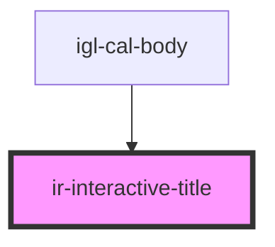

# ir-interactive-title

<!-- Auto Generated Below -->

## Properties

| Property        | Attribute         | Description                                                                                                                                                                                                           | Type      | Default  |
| --------------- | ----------------- | --------------------------------------------------------------------------------------------------------------------------------------------------------------------------------------------------------------------- | --------- | -------- |
| `cropSize`      | `crop-size`       | Character-count threshold above which the full-title tooltip is shown. Acts as a fast approximation of visual overflow; the browser independently applies `text-overflow: ellipsis` via CSS regardless of this value. | `number`  | `20`     |
| `hkStatus`      | `hk-status`       | When `true`, renders the `.hk-dot` container and the `slot[name="end"]` inside it. Must be `true` whenever slot content is provided, otherwise the slotted nodes are silently discarded by the browser.               | `boolean` | `false`  |
| `irPopoverLeft` | `ir-popover-left` | Horizontal padding of the `.hk-dot` slot container, forwarded as the `--ir-popover-left` CSS custom property on the host element.                                                                                     | `string`  | `'10px'` |
| `popoverTitle`  | `popover-title`   | The full title string. When its length exceeds `cropSize` the tooltip is activated so the user can read the complete text on hover.                                                                                   | `string`  | `''`     |

## Slots

| Slot    | Description                                                                                         |
| ------- | --------------------------------------------------------------------------------------------------- |
| `"end"` | Icon(s) placed after the title (broom, alert, etc.).       Only rendered when `hkStatus` is `true`. |

## Dependencies

### Used by

 - [igl-cal-body](../../igloo-calendar/igl-cal-body)

### Graph

```mermaid
graph TD;
  igl-cal-body --> ir-interactive-title
  style ir-interactive-title fill:#f9f,stroke:#333,stroke-width:4px
```

----------------------------------------------

*Built with [StencilJS](https://stenciljs.com/)*
