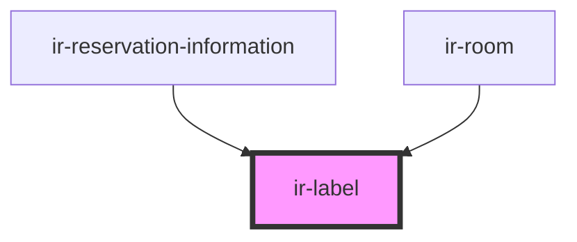

# ir-label

<!-- Auto Generated Below -->

## Properties

| Property              | Attribute                | Description                                              | Type                                            | Default     |
| --------------------- | ------------------------ | -------------------------------------------------------- | ----------------------------------------------- | ----------- |
| `content`             | `content`                | The main text or HTML content to display                 | `string`                                        | `undefined` |
| `display`             | `display`                |                                                          | `"flex" \| "inline"`                            | `'flex'`    |
| `ignoreEmptyContent`  | `ignore-empty-content`   | If true, label will ignore checking for an empty content | `boolean`                                       | `false`     |
| `image`               | --                       | Object representing the image used within the label      | `{ src: string; alt: string; style?: string; }` | `null`      |
| `imageStyle`          | `image-style`            | Additional CSS classes or style for the image            | `string`                                        | `''`        |
| `isCountryImage`      | `is-country-image`       | Renders a country-type image style (vs. a 'logo')        | `boolean`                                       | `false`     |
| `labelText`           | `label-text`             | The text to display as the label's title                 | `string`                                        | `undefined` |
| `placeholder`         | `placeholder`            | Placeholder text to display if content is empty          | `string`                                        | `undefined` |
| `renderContentAsHtml` | `render-content-as-html` | If true, will render `content` as HTML                   | `boolean`                                       | `false`     |

## Dependencies

### Used by

 - [ir-reservation-information](../../ir-booking-details/ir-reservation-information)
 - [ir-room](../../ir-booking-details/ir-room)

### Graph

----------------------------------------------

*Built with [StencilJS](https://stenciljs.com/)*
