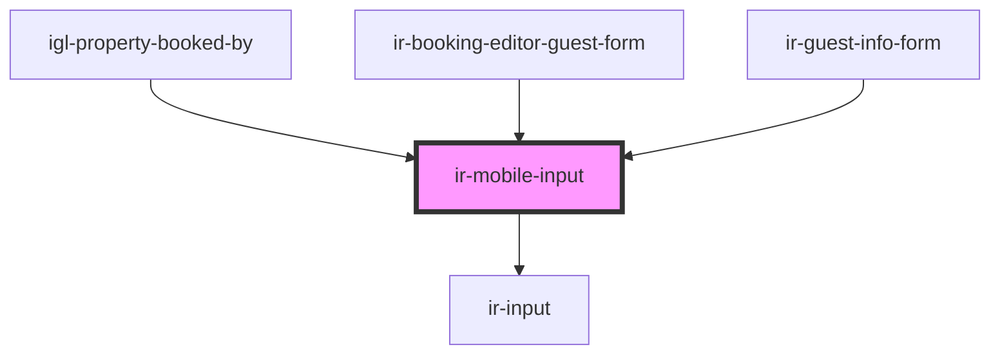

# ir-mobile-input

<!-- Auto Generated Below -->

## Properties

| Property      | Attribute      | Description                                                                                            | Type                             | Default                |
| ------------- | -------------- | ------------------------------------------------------------------------------------------------------ | -------------------------------- | ---------------------- |
| `countries`   | --             | Country list, used to populate prefix and dropdown. If not provided, fetched from the booking service. | `ICountry[]`                     | `[]`                   |
| `countryCode` | `country-code` | Selected country ISO code. Component updates this prop when a new country is chosen                    | `string`                         | `undefined`            |
| `description` | `description`  | Help text rendered under the label                                                                     | `string`                         | `undefined`            |
| `disabled`    | `disabled`     | Whether the control is disabled                                                                        | `boolean`                        | `false`                |
| `error`       | `error`        | Error message announced to screen readers                                                              | `string`                         | `undefined`            |
| `label`       | `label`        | Visible label for the phone input                                                                      | `string`                         | `'Phone number'`       |
| `name`        | `name`         | Name attribute passed to the native input                                                              | `string`                         | `'phone'`              |
| `placeholder` | `placeholder`  | Placeholder shown when the input is empty                                                              | `string`                         | `'Enter phone number'` |
| `required`    | `required`     | Native required attribute                                                                              | `boolean`                        | `false`                |
| `size`        | `size`         | The input's size.                                                                                      | `"large" \| "medium" \| "small"` | `'small'`              |
| `value`       | `value`        | Input value without formatting. Component keeps this prop in sync                                      | `string`                         | `''`                   |

## Events

| Event                         | Description | Type                                     |
| ----------------------------- | ----------- | ---------------------------------------- |
| `mobile-input-change`         |             | `CustomEvent<IrMobileInputChangeDetail>` |
| `mobile-input-country-change` |             | `CustomEvent<ICountry>`                  |

## Dependencies

### Used by

 - [igl-property-booked-by](../../igloo-calendar/igl-book-property/igl-booking-form/igl-property-booked-by)
 - [ir-booking-editor-guest-form](../../igloo-calendar/ir-booking-editor/ir-booking-editor-guest-form)
 - [ir-guest-info-form](../../ir-guest-info/ir-guest-info-form)

### Depends on

- [ir-input](../ir-input)

### Graph

----------------------------------------------

*Built with [StencilJS](https://stenciljs.com/)*
