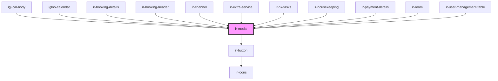

# ir-modal


<!-- Auto Generated Below -->


## Properties

| Property         | Attribute          | Description                                                           | Type                                                                                            | Default         |
| ---------------- | ------------------ | --------------------------------------------------------------------- | ----------------------------------------------------------------------------------------------- | --------------- |
| `autoClose`      | `auto-close`       | If true, the modal automatically closes after confirm/cancel actions. | `boolean`                                                                                       | `true`          |
| `btnPosition`    | `btn-position`     | Horizontal alignment of the footer buttons.                           | `"center" \| "left" \| "right"`                                                                 | `'right'`       |
| `icon`           | `icon`             | Icon name to render next to the title (if `iconAvailable` is true).   | `string`                                                                                        | `''`            |
| `iconAvailable`  | `icon-available`   | Whether an icon should be displayed next to the title.                | `boolean`                                                                                       | `false`         |
| `isLoading`      | `is-loading`       | Whether the modal is in a loading state, disabling interaction.       | `boolean`                                                                                       | `false`         |
| `item`           | `item`             | Payload object to pass along with confirm/cancel events.              | `any`                                                                                           | `{}`            |
| `leftBtnActive`  | `left-btn-active`  | Whether the left (cancel/close) button is visible.                    | `boolean`                                                                                       | `true`          |
| `leftBtnColor`   | `left-btn-color`   | Color theme of the left button.                                       | `"danger" \| "dark" \| "info" \| "light" \| "primary" \| "secondary" \| "success" \| "warning"` | `'secondary'`   |
| `leftBtnText`    | `left-btn-text`    | Text displayed on the left (cancel/close) button.                     | `string`                                                                                        | `'Close'`       |
| `modalBody`      | `modal-body`       | The main content text shown in the modal body.                        | `string`                                                                                        | `'Modal Body'`  |
| `modalTitle`     | `modal-title`      | The title text displayed in the modal header.                         | `string`                                                                                        | `'Modal Title'` |
| `rightBtnActive` | `right-btn-active` | Whether the right (confirm) button is visible.                        | `boolean`                                                                                       | `true`          |
| `rightBtnColor`  | `right-btn-color`  | Color theme of the right button.                                      | `"danger" \| "dark" \| "info" \| "light" \| "primary" \| "secondary" \| "success" \| "warning"` | `'primary'`     |
| `rightBtnText`   | `right-btn-text`   | Text displayed on the right (confirm) button.                         | `string`                                                                                        | `'Confirm'`     |
| `showTitle`      | `show-title`       | Controls whether the modal title is rendered.                         | `boolean`                                                                                       | `undefined`     |


## Events

| Event          | Description                                                                       | Type               |
| -------------- | --------------------------------------------------------------------------------- | ------------------ |
| `cancelModal`  | Fired when the cancel (left) button or backdrop is clicked.                       | `CustomEvent<any>` |
| `confirmModal` | Fired when the confirm (right) button is clicked. Emits the current `item` value. | `CustomEvent<any>` |


## Methods

### `closeModal() => Promise<void>`

Closes the modal.

#### Returns

Type: `Promise<void>`


### `openModal() => Promise<void>`

Opens the modal.

Example:
```ts
const modal = document.querySelector('ir-modal');
modal.openModal();
```

#### Returns

Type: `Promise<void>`


## Dependencies

### Used by

 - [igl-cal-body](../../igloo-calendar/igl-cal-body)
 - [igloo-calendar](../../igloo-calendar)
 - [ir-booking-details](../../ir-booking-details)
 - [ir-booking-header](../../ir-booking-details/ir-booking-header)
 - [ir-channel](../../ir-channel)
 - [ir-extra-service](../../ir-booking-details/ir-extra-services/ir-extra-service)
 - [ir-hk-tasks](../../ir-housekeeping/ir-hk-tasks)
 - [ir-housekeeping](../../ir-housekeeping)
 - [ir-payment-details](../../ir-booking-details/ir-payment-details)
 - [ir-room](../../ir-booking-details/ir-room)
 - [ir-user-management-table](../../ir-user-management/ir-user-management-table)

### Depends on

- [ir-button](../ir-button)

### Graph


----------------------------------------------

*Built with [StencilJS](https://stenciljs.com/)*
