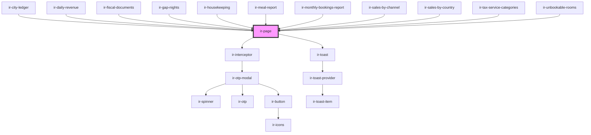

# ir-page

<!-- Auto Generated Below -->

## Properties

| Property      | Attribute     | Description | Type     | Default     |
| ------------- | ------------- | ----------- | -------- | ----------- |
| `description` | `description` |             | `string` | `undefined` |
| `label`       | `label`       |             | `string` | `undefined` |

## Shadow Parts

| Part     | Description |
| -------- | ----------- |
| `"body"` |             |

## Dependencies

### Used by

 - [ir-city-ledger](../../ir-city-ledger)
 - [ir-daily-revenue](../../ir-daily-revenue)
 - [ir-fiscal-documents](../../ir-fiscal-documents)
 - [ir-gap-nights](../../ir-gap-nights)
 - [ir-housekeeping](../../ir-housekeeping)
 - [ir-meal-report](../../ir-meal-report)
 - [ir-monthly-bookings-report](../../ir-monthly-bookings-report)
 - [ir-sales-by-channel](../../ir-sales-by-channel)
 - [ir-sales-by-country](../../ir-sales-by-country)
 - [ir-tax-service-categories](../../ir-tax-service-categories)
 - [ir-unbookable-rooms](../../ir-unbookable-rooms)

### Depends on

- [ir-interceptor](../../ir-interceptor)
- [ir-toast](../ir-toast)

### Graph

----------------------------------------------

*Built with [StencilJS](https://stenciljs.com/)*
