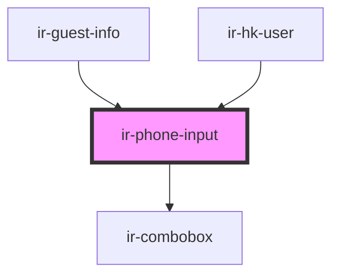

# ir-phone-input


<!-- Auto Generated Below -->


## Properties

| Property          | Attribute         | Description                                                                                                                                                                                                                                                                                                                                                                                                                                                                                                                                                                                        | Type                    | Default     |
| ----------------- | ----------------- | -------------------------------------------------------------------------------------------------------------------------------------------------------------------------------------------------------------------------------------------------------------------------------------------------------------------------------------------------------------------------------------------------------------------------------------------------------------------------------------------------------------------------------------------------------------------------------------------------- | ----------------------- | ----------- |
| `countries`       | --                | Country list, used to populate prefix and dropdown. If not provided, fetched from the booking service.                                                                                                                                                                                                                                                                                                                                                                                                                                                                                             | `ICountry[]`            | `[]`        |
| `default_country` | `default_country` | Default country ID used if no phone prefix is set.                                                                                                                                                                                                                                                                                                                                                                                                                                                                                                                                                 | `number`                | `null`      |
| `disabled`        | `disabled`        | Disables the phone input when true.                                                                                                                                                                                                                                                                                                                                                                                                                                                                                                                                                                | `boolean`               | `false`     |
| `error`           | `error`           | If true, styles the input to indicate an error state.                                                                                                                                                                                                                                                                                                                                                                                                                                                                                                                                              | `boolean`               | `false`     |
| `floatingLabel`   | `floating-label`  | Floating label text that appears inside the input and “floats” above when the field is focused or has a value.  - If provided, a floating label will be rendered inside the input container. - If you omit this prop but set `label`, the old left-side static label is used. - If you provide both `label` and `floatingLabel`, only the floating label is shown.  Accessibility: - The floating label is tied to the input via `aria-labelledby`. - You can still set `placeholder`; the label will not be replaced by it.  Examples: ```tsx <ir-phone-input floating-label label="Phone" /> ``` | `boolean`               | `undefined` |
| `label`           | `label`           | Label displayed next to the phone input.                                                                                                                                                                                                                                                                                                                                                                                                                                                                                                                                                           | `string`                | `undefined` |
| `language`        | `language`        | Two-letter language code used for country fetching.                                                                                                                                                                                                                                                                                                                                                                                                                                                                                                                                                | `string`                | `undefined` |
| `mode`            | `mode`            |                                                                                                                                                                                                                                                                                                                                                                                                                                                                                                                                                                                                    | `"default" \| "modern"` | `'default'` |
| `phone_prefix`    | `phone_prefix`    | If provided, sets the phone prefix and updates selected country.                                                                                                                                                                                                                                                                                                                                                                                                                                                                                                                                   | `string`                | `null`      |
| `placeholder`     | `placeholder`     | Placeholder text for the input.                                                                                                                                                                                                                                                                                                                                                                                                                                                                                                                                                                    | `string`                | `undefined` |
| `testId`          | `test-id`         | Identifier for test automation.                                                                                                                                                                                                                                                                                                                                                                                                                                                                                                                                                                    | `string`                | `undefined` |
| `token`           | `token`           | Auth token used by the booking service (if needed).                                                                                                                                                                                                                                                                                                                                                                                                                                                                                                                                                | `string`                | `undefined` |
| `value`           | `value`           | Initial phone number value.                                                                                                                                                                                                                                                                                                                                                                                                                                                                                                                                                                        | `string`                | `''`        |


## Events

| Event        | Description                                                                                                                                                                | Type                                                     |
| ------------ | -------------------------------------------------------------------------------------------------------------------------------------------------------------------------- | -------------------------------------------------------- |
| `textChange` | Emits when the user changes the phone number. Emits `{ phone_prefix, mobile }` object.  Example: ```tsx <ir-phone-input onTextChange={(e) => console.log(e.detail)} /> ``` | `CustomEvent<{ phone_prefix: string; mobile: string; }>` |


## CSS Custom Properties

| Name                                        | Description                                                |
| ------------------------------------------- | ---------------------------------------------------------- |
| `--ir-floating-label-bg`                    | Background behind the floated label “chip”.                |
| `--ir-floating-label-fg`                    | Resting label color.                                       |
| `--ir-floating-label-fg-focus`              | Floated/active label color.                                |
| `--ir-floating-label-float-translateY`      | translateY used when label floats (relative to its top=0). |
| `--ir-floating-label-resting-offset-inline` | Inline offset for the resting label (LTR=left, RTL=right). |
| `--ir-floating-label-scale`                 | Scale applied to the label when floated.                   |
| `--ir-floating-phone-input-height`          | Fixed height for the input element.                        |
| `--ir-floating-phone-input-radius`          | Radius of the select.                                      |


## Dependencies

### Used by

 - [ir-guest-info](../../ir-guest-info)
 - [ir-hk-user](../../ir-housekeeping/ir-hk-user)

### Depends on

- [ir-combobox](../ir-combobox)

### Graph


----------------------------------------------

*Built with [StencilJS](https://stenciljs.com/)*
