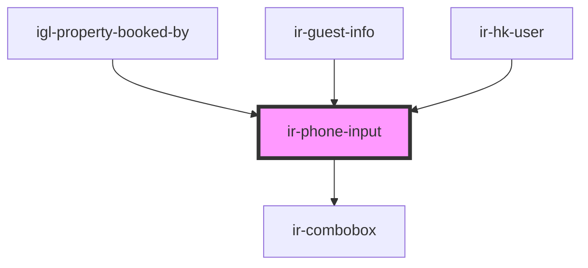

# ir-phone-input


<!-- Auto Generated Below -->


## Properties

| Property          | Attribute         | Description                                                                                            | Type         | Default     |
| ----------------- | ----------------- | ------------------------------------------------------------------------------------------------------ | ------------ | ----------- |
| `countries`       | --                | Country list, used to populate prefix and dropdown. If not provided, fetched from the booking service. | `ICountry[]` | `[]`        |
| `default_country` | `default_country` | Default country ID used if no phone prefix is set.                                                     | `number`     | `null`      |
| `disabled`        | `disabled`        | Disables the phone input when true.                                                                    | `boolean`    | `false`     |
| `error`           | `error`           | If true, styles the input to indicate an error state.                                                  | `boolean`    | `false`     |
| `label`           | `label`           | Label displayed next to the phone input.                                                               | `string`     | `undefined` |
| `language`        | `language`        | Two-letter language code used for country fetching.                                                    | `string`     | `undefined` |
| `phone_prefix`    | `phone_prefix`    | If provided, sets the phone prefix and updates selected country.                                       | `string`     | `null`      |
| `placeholder`     | `placeholder`     | Placeholder text for the input.                                                                        | `string`     | `undefined` |
| `testId`          | `test-id`         | Identifier for test automation.                                                                        | `string`     | `undefined` |
| `token`           | `token`           | Auth token used by the booking service (if needed).                                                    | `string`     | `undefined` |
| `value`           | `value`           | Initial phone number value.                                                                            | `string`     | `''`        |


## Events

| Event        | Description                                                                                                                                                                | Type                                                     |
| ------------ | -------------------------------------------------------------------------------------------------------------------------------------------------------------------------- | -------------------------------------------------------- |
| `textChange` | Emits when the user changes the phone number. Emits `{ phone_prefix, mobile }` object.  Example: ```tsx <ir-phone-input onTextChange={(e) => console.log(e.detail)} /> ``` | `CustomEvent<{ phone_prefix: string; mobile: string; }>` |


## Dependencies

### Used by

 - [igl-property-booked-by](../../igloo-calendar/igl-book-property/igl-booking-form/igl-property-booked-by)
 - [ir-guest-info](../../ir-guest-info)
 - [ir-hk-user](../../ir-housekeeping/ir-hk-user)

### Depends on

- [ir-combobox](../ir-combobox)

### Graph


----------------------------------------------

*Built with [StencilJS](https://stenciljs.com/)*
