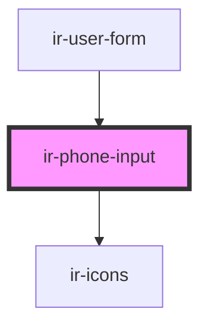

# ir-phone-input

<!-- Auto Generated Below -->

## Properties

| Property        | Attribute       | Description | Type      | Default     |
| --------------- | --------------- | ----------- | --------- | ----------- |
| `error`         | `error`         |             | `boolean` | `undefined` |
| `mobile_number` | `mobile_number` |             | `string`  | `''`        |

## Events

| Event        | Description | Type                                                     |
| ------------ | ----------- | -------------------------------------------------------- |
| `textChange` |             | `CustomEvent<{ phone_prefix: string; mobile: string; }>` |

## Dependencies

### Used by

 - [ir-user-form](../../ir-booking-engine/ir-checkout-page/ir-user-form)

### Depends on

- [ir-icons](../ir-icons)

### Graph

```mermaid
graph TD;
  ir-phone-input --> ir-icons
  ir-user-form --> ir-phone-input
  style ir-phone-input fill:#f9f,stroke:#333,stroke-width:4px
```

----------------------------------------------

*Built with [StencilJS](https://stenciljs.com/)*
