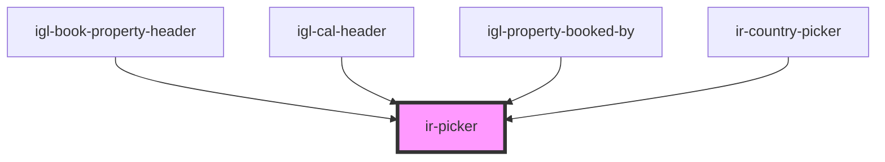

# ir-picker

<!-- Auto Generated Below -->

## Properties

| Property       | Attribute       | Description                                                                                                                          | Type                                          | Default     |
| -------------- | --------------- | ------------------------------------------------------------------------------------------------------------------------------------ | --------------------------------------------- | ----------- |
| `appearance`   | `appearance`    | The input's visual appearance.                                                                                                       | `"filled" \| "filled-outlined" \| "outlined"` | `undefined` |
| `debounce`     | `debounce`      | Delay (in milliseconds) before emitting the `text-change` event. Defaults to 300ms for async mode.                                   | `number`                                      | `0`         |
| `defaultValue` | `default-value` | The default value of the form control. Primarily used for resetting the form control.                                                | `string`                                      | `undefined` |
| `label`        | `label`         | Optional label applied to the text field.                                                                                            | `string`                                      | `undefined` |
| `loading`      | `loading`       |                                                                                                                                      | `boolean`                                     | `false`     |
| `mode`         | `mode`          |                                                                                                                                      | `"default" \| "select" \| "select-async"`     | `'default'` |
| `pill`         | `pill`          |                                                                                                                                      | `boolean`                                     | `false`     |
| `placeholder`  | `placeholder`   | Placeholder shown inside the input when there is no query.                                                                           | `string`                                      | `''`        |
| `size`         | `size`          | The input's size.                                                                                                                    | `"large" \| "medium" \| "small"`              | `'small'`   |
| `value`        | `value`         | Selected value (also shown in the input when `mode="select"`).                                                                       | `string`                                      | `''`        |
| `withClear`    | `with-clear`    | Whether to show a clear button inside the input. When clicked, the input value is cleared and the `combobox-clear` event is emitted. | `boolean`                                     | `false`     |

## Events

| Event             | Description                                                                 | Type                                       |
| ----------------- | --------------------------------------------------------------------------- | ------------------------------------------ |
| `combobox-clear`  | Emitted when the clear button is clicked and the combobox value is cleared. | `CustomEvent<void>`                        |
| `combobox-select` | Emitted when a value is selected from the combobox list.                    | `CustomEvent<IrComboboxSelectEventDetail>` |
| `text-change`     | Emitted when the text input value changes.                                  | `CustomEvent<string>`                      |

## Methods

### `close() => Promise<void>`

#### Returns

Type: `Promise<void>`

### `open() => Promise<void>`

#### Returns

Type: `Promise<void>`

## Dependencies

### Used by

 - [igl-book-property-header](../../igloo-calendar/igl-book-property/igl-book-property-header)
 - [igl-cal-header](../../igloo-calendar/igl-cal-header)
 - [igl-property-booked-by](../../igloo-calendar/igl-book-property/igl-booking-form/igl-property-booked-by)
 - [ir-country-picker](../ir-country-picker)

### Graph

----------------------------------------------

*Built with [StencilJS](https://stenciljs.com/)*
