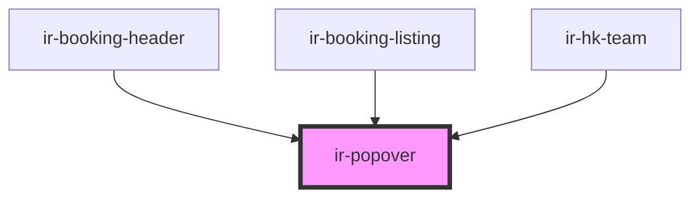

# ir-popover

<!-- Auto Generated Below -->

## Properties

| Property              | Attribute                | Description                                                                                                        | Type                                               | Default     |
| --------------------- | ------------------------ | ------------------------------------------------------------------------------------------------------------------ | -------------------------------------------------- | ----------- |
| `content`             | `content`                | Content to display inside the popover. Can be plain text or HTML depending on `renderContentAsHtml`.               | `string`                                           | `undefined` |
| `irPopoverLeft`       | `ir-popover-left`        | Horizontal offset (left) of the popover from its trigger. Used in inline style as `--ir-popover-left`.             | `string`                                           | `'10px'`    |
| `placement`           | `placement`              | Position of the popover relative to the trigger. Options: `'top'`, `'bottom'`, `'left'`, `'right'`, `'auto'`.      | `"auto" \| "bottom" \| "left" \| "right" \| "top"` | `'auto'`    |
| `renderContentAsHtml` | `render-content-as-html` | Whether to treat `content` as raw HTML. When true, `content` will be injected with `html: true` in jQuery popover. | `boolean`                                          | `false`     |
| `trigger`             | `trigger`                | Event that triggers the popover. Options: `'focus'`, `'click'`, `'hover'`.                                         | `"click" \| "focus" \| "hover"`                    | `'focus'`   |

## Dependencies

### Used by

 - [ir-booking-header](../../ir-booking-details/ir-booking-header)
 - [ir-booking-listing](../../ir-booking-listing)
 - [ir-hk-team](../../ir-housekeeping/ir-hk-team)

### Graph

----------------------------------------------

*Built with [StencilJS](https://stenciljs.com/)*
