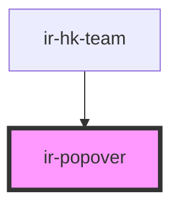

# ir-popover

<!-- Auto Generated Below -->

## Properties

| Property              | Attribute                | Description | Type                                               | Default     |
| --------------------- | ------------------------ | ----------- | -------------------------------------------------- | ----------- |
| `content`             | `content`                |             | `string`                                           | `undefined` |
| `irPopoverLeft`       | `ir-popover-left`        |             | `string`                                           | `'10px'`    |
| `placement`           | `placement`              |             | `"auto" \| "bottom" \| "left" \| "right" \| "top"` | `'auto'`    |
| `renderContentAsHtml` | `render-content-as-html` |             | `boolean`                                          | `false`     |
| `trigger`             | `trigger`                |             | `"click" \| "focus" \| "hover"`                    | `'focus'`   |

## Dependencies

### Used by

 - [ir-hk-team](../../ir-housekeeping/ir-hk-team)

### Graph

----------------------------------------------

*Built with [StencilJS](https://stenciljs.com/)*
