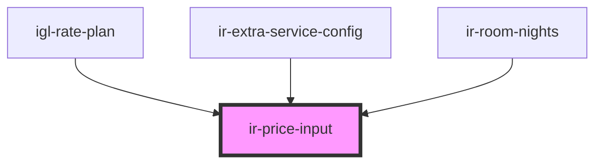

# ir-price-input

<!-- Auto Generated Below -->

## Properties

| Property       | Attribute       | Description                                                      | Type                     | Default     |
| -------------- | --------------- | ---------------------------------------------------------------- | ------------------------ | ----------- |
| `autoValidate` | `auto-validate` | The AutoValidate for the input, optional                         | `boolean`                | `true`      |
| `currency`     | `currency`      | The Currency for the input, optional                             | `string`                 | `undefined` |
| `disabled`     | `disabled`      | The disabled for the input, optional                             | `boolean`                | `undefined` |
| `inputStyle`   | `input-style`   | Extra classnames for the input, optional                         | `string`                 | `undefined` |
| `label`        | `label`         | The label for the input, optional                                | `string`                 | `undefined` |
| `labelStyle`   | `label-style`   | Extra classnames for the label, optional                         | `string`                 | `undefined` |
| `maxValue`     | `max-value`     | Maximum value for the price                                      | `number`                 | `undefined` |
| `minValue`     | `min-value`     | Minimum value for the price                                      | `number`                 | `undefined` |
| `placeholder`  | `placeholder`   | Placeholder text for the input                                   | `string`                 | `''`        |
| `required`     | `required`      | Whether the input is required                                    | `boolean`                | `false`     |
| `value`        | `value`         | Initial value for the input                                      | `string`                 | `''`        |
| `wrapKey`      | `wrap-key`      | Indicates the key to wrap the value (e.g., 'price' or 'cost')    | `string`                 | `undefined` |
| `zod`          | --              | A Zod schema for validating the input Example: z.coerce.number() | `ZodType<any, any, any>` | `undefined` |

## Events

| Event        | Description                       | Type                  |
| ------------ | --------------------------------- | --------------------- |
| `inputBlur`  | Emits the current value on blur   | `CustomEvent<string>` |
| `inputFocus` | Emits the current value on focus  | `CustomEvent<void>`   |
| `textChange` | Emits the current value on change | `CustomEvent<string>` |

## Dependencies

### Used by

 - [igl-rate-plan](../../igloo-calendar/igl-book-property/igl-booking-overview-page/igl-room-type/igl-rate-plan)
 - [ir-extra-service-config](../../ir-booking-details/ir-extra-services/ir-extra-service-config)
 - [ir-room-nights](../../igloo-calendar/ir-room-nights)

### Graph

----------------------------------------------

*Built with [StencilJS](https://stenciljs.com/)*
