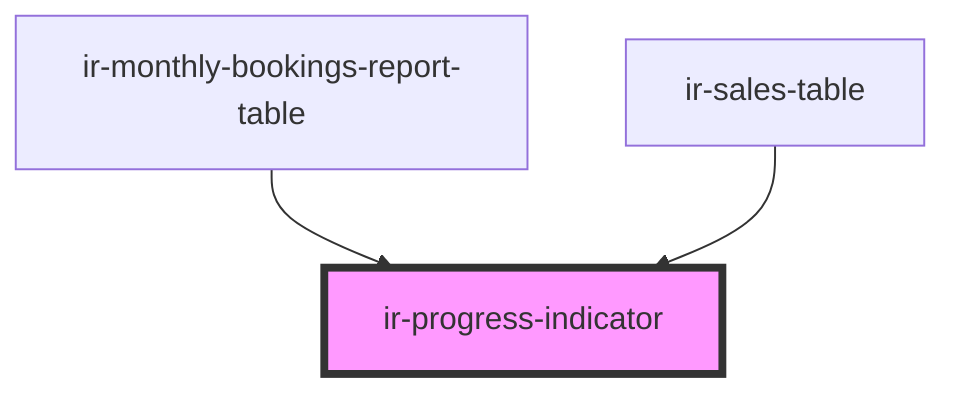

# ir-progress-indicator

<!-- Auto Generated Below -->

## Properties

| Property     | Attribute    | Description                                                                         | Type                       | Default     |
| ------------ | ------------ | ----------------------------------------------------------------------------------- | -------------------------- | ----------- |
| `color`      | `color`      | The color variant of the progress bar. Options: - 'primary' (default) - 'secondary' | `"primary" \| "secondary"` | `'primary'` |
| `percentage` | `percentage` | The percentage value to display and fill the progress bar. Example: "75%"           | `string`                   | `undefined` |

## Dependencies

### Used by

 - [ir-monthly-bookings-report-table](../../ir-monthly-bookings-report/ir-monthly-bookings-report-table)
 - [ir-sales-table](../../ir-sales-by-country/ir-sales-table)

### Graph

----------------------------------------------

*Built with [StencilJS](https://stenciljs.com/)*
