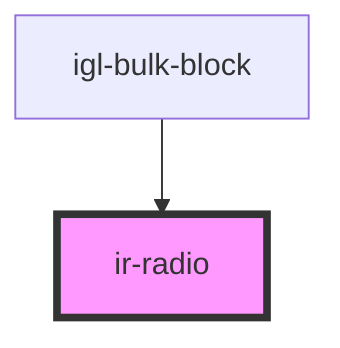

# ir-radio

<!-- Auto Generated Below -->

## Properties

| Property        | Attribute       | Description                                                   | Type      | Default     |
| --------------- | --------------- | ------------------------------------------------------------- | --------- | ----------- |
| `checked`       | `checked`       | Whether the checkbox is checked.                              | `boolean` | `false`     |
| `disabled`      | `disabled`      | Disables the checkbox when true.                              | `boolean` | `undefined` |
| `indeterminate` | `indeterminate` | Whether the checkbox is in an indeterminate state.            | `boolean` | `undefined` |
| `label`         | `label`         | The label text associated with the checkbox.                  | `string`  | `undefined` |
| `labelClass`    | `label-class`   | CSS class applied to the label element.                       | `string`  | `undefined` |
| `name`          | `name`          | The name attribute of the checkbox, used for form submission. | `string`  | `undefined` |
| `radioBoxId`    | `radio-box-id`  | The unique ID of the checkbox element.                        | `string`  | `v4()`      |

## Events

| Event         | Description                                        | Type                   |
| ------------- | -------------------------------------------------- | ---------------------- |
| `checkChange` | Emitted when the checkbox's checked state changes. | `CustomEvent<boolean>` |

## Dependencies

### Used by

 - [igl-bulk-block](../../igloo-calendar/igl-bulk-operations/igl-bulk-block)

### Graph

----------------------------------------------

*Built with [StencilJS](https://stenciljs.com/)*
