# ir-select

<!-- Auto Generated Below -->

## Properties

| Property               | Attribute                | Description                     | Type                                                                                                                 | Default     |
| ---------------------- | ------------------------ | ------------------------------- | -------------------------------------------------------------------------------------------------------------------- | ----------- |
| `LabelAvailable`       | `label-available`        |                                 | `boolean`                                                                                                            | `true`      |
| `data`                 | --                       |                                 | `selectOption[]`                                                                                                     | `undefined` |
| `disabled`             | `disabled`               |                                 | `boolean`                                                                                                            | `undefined` |
| `error`                | `error`                  | Whether the select has an error | `boolean`                                                                                                            | `false`     |
| `firstOption`          | `first-option`           |                                 | `string`                                                                                                             | `'Select'`  |
| `label`                | `label`                  |                                 | `string`                                                                                                             | `'<label>'` |
| `labelBackground`      | `label-background`       |                                 | `"danger" \| "dark" \| "info" \| "light" \| "primary" \| "secondary" \| "success" \| "warning"`                      | `null`      |
| `labelBorder`          | `label-border`           |                                 | `"danger" \| "dark" \| "info" \| "light" \| "none" \| "primary" \| "secondary" \| "success" \| "theme" \| "warning"` | `'theme'`   |
| `labelColor`           | `label-color`            |                                 | `"danger" \| "dark" \| "info" \| "light" \| "primary" \| "secondary" \| "success" \| "warning"`                      | `'dark'`    |
| `labelPosition`        | `label-position`         |                                 | `"center" \| "left" \| "right"`                                                                                      | `'left'`    |
| `labelWidth`           | `label-width`            |                                 | `1 \| 10 \| 11 \| 2 \| 3 \| 4 \| 5 \| 6 \| 7 \| 8 \| 9`                                                              | `3`         |
| `name`                 | `name`                   |                                 | `string`                                                                                                             | `undefined` |
| `required`             | `required`               |                                 | `boolean`                                                                                                            | `undefined` |
| `selectContainerStyle` | `select-container-style` |                                 | `string`                                                                                                             | `undefined` |
| `selectForcedStyles`   | --                       |                                 | `{ [key: string]: string; }`                                                                                         | `undefined` |
| `selectStyle`          | `select-style`           |                                 | `boolean`                                                                                                            | `true`      |
| `selectStyles`         | `select-styles`          |                                 | `string`                                                                                                             | `undefined` |
| `select_id`            | `select_id`              |                                 | `string`                                                                                                             | `v4()`      |
| `selectedValue`        | `selected-value`         |                                 | `any`                                                                                                                | `null`      |
| `showFirstOption`      | `show-first-option`      |                                 | `boolean`                                                                                                            | `true`      |
| `size`                 | `size`                   |                                 | `"lg" \| "md" \| "sm"`                                                                                               | `'md'`      |
| `submited`             | `submited`               |                                 | `boolean`                                                                                                            | `false`     |
| `testId`               | `test-id`                |                                 | `string`                                                                                                             | `undefined` |
| `textSize`             | `text-size`              |                                 | `"lg" \| "md" \| "sm"`                                                                                               | `'md'`      |

## Events

| Event          | Description | Type               |
| -------------- | ----------- | ------------------ |
| `selectChange` |             | `CustomEvent<any>` |

## Dependencies

### Used by

 - [igl-book-property-header](../../igloo-calendar/igl-book-property/igl-book-property-header)
 - [ir-booking-header](../../ir-booking-details/ir-booking-header)
 - [ir-booking-listing](../../ir-booking-listing)
 - [ir-delete-modal](../../ir-housekeeping/ir-delete-modal)
 - [ir-hk-archive](../../ir-housekeeping/ir-hk-tasks/ir-hk-archive)
 - [ir-hk-unassigned-units](../../ir-housekeeping/ir-hk-unassigned-units)
 - [ir-housekeeping](../../ir-housekeeping)
 - [ir-listing-header](../../ir-booking-listing/ir-listing-header)
 - [ir-listing-modal](../../ir-booking-listing/ir-listing-modal)
 - [ir-option-details](../../ir-payment-option/ir-option-details)
 - [ir-pickup](../../ir-booking-details/ir-pickup)
 - [ir-room-guests](../../ir-booking-details/ir-room-guests)
 - [ir-sales-filters](../../ir-sales-by-country/ir-sales-filters)
 - [ir-tasks-filters](../../ir-housekeeping/ir-hk-tasks/ir-tasks-filters)
 - [ir-unit-status](../../ir-housekeeping/ir-unit-status)
 - [ir-user-form-panel](../../ir-user-management/ir-user-form-panel)

### Graph

```mermaid
graph TD;
  igl-book-property-header --> ir-select
  ir-booking-header --> ir-select
  ir-booking-listing --> ir-select
  ir-delete-modal --> ir-select
  ir-hk-archive --> ir-select
  ir-hk-unassigned-units --> ir-select
  ir-housekeeping --> ir-select
  ir-listing-header --> ir-select
  ir-listing-modal --> ir-select
  ir-option-details --> ir-select
  ir-pickup --> ir-select
  ir-room-guests --> ir-select
  ir-sales-filters --> ir-select
  ir-tasks-filters --> ir-select
  ir-unit-status --> ir-select
  ir-user-form-panel --> ir-select
  style ir-select fill:#f9f,stroke:#333,stroke-width:4px
```

----------------------------------------------

*Built with [StencilJS](https://stenciljs.com/)*
