# ir-select


<!-- Auto Generated Below -->


## Properties

| Property               | Attribute                | Description                                                                                                                                                                                                                                                                                                                                                                                                                          | Type                                                                                                                 | Default     |
| ---------------------- | ------------------------ | ------------------------------------------------------------------------------------------------------------------------------------------------------------------------------------------------------------------------------------------------------------------------------------------------------------------------------------------------------------------------------------------------------------------------------------ | -------------------------------------------------------------------------------------------------------------------- | ----------- |
| `data`                 | --                       |                                                                                                                                                                                                                                                                                                                                                                                                                                      | `selectOption[]`                                                                                                     | `undefined` |
| `disabled`             | `disabled`               |                                                                                                                                                                                                                                                                                                                                                                                                                                      | `boolean`                                                                                                            | `undefined` |
| `error`                | `error`                  |                                                                                                                                                                                                                                                                                                                                                                                                                                      | `boolean`                                                                                                            | `false`     |
| `firstOption`          | `first-option`           |                                                                                                                                                                                                                                                                                                                                                                                                                                      | `string`                                                                                                             | `'Select'`  |
| `floatingLabel`        | `floating-label`         | Floating label text that appears inside the input and “floats” above when the field is focused or has a value.  - If provided, a floating label will be rendered inside the input container. - If you omit this prop but set `label`, the old left-side static label is used. - If you provide both `label` and `floatingLabel`, only the floating label is shown.   Examples: ```tsx <ir-select floating-label label="Phone" /> ``` | `boolean`                                                                                                            | `undefined` |
| `label`                | `label`                  |                                                                                                                                                                                                                                                                                                                                                                                                                                      | `string`                                                                                                             | `undefined` |
| `labelBackground`      | `label-background`       |                                                                                                                                                                                                                                                                                                                                                                                                                                      | `"danger" \| "dark" \| "info" \| "light" \| "primary" \| "secondary" \| "success" \| "warning"`                      | `null`      |
| `labelBorder`          | `label-border`           |                                                                                                                                                                                                                                                                                                                                                                                                                                      | `"danger" \| "dark" \| "info" \| "light" \| "none" \| "primary" \| "secondary" \| "success" \| "theme" \| "warning"` | `'theme'`   |
| `labelColor`           | `label-color`            |                                                                                                                                                                                                                                                                                                                                                                                                                                      | `"danger" \| "dark" \| "info" \| "light" \| "primary" \| "secondary" \| "success" \| "warning"`                      | `'dark'`    |
| `labelPosition`        | `label-position`         |                                                                                                                                                                                                                                                                                                                                                                                                                                      | `"center" \| "left" \| "right"`                                                                                      | `'left'`    |
| `labelWidth`           | `label-width`            |                                                                                                                                                                                                                                                                                                                                                                                                                                      | `1 \| 10 \| 11 \| 2 \| 3 \| 4 \| 5 \| 6 \| 7 \| 8 \| 9`                                                              | `3`         |
| `name`                 | `name`                   |                                                                                                                                                                                                                                                                                                                                                                                                                                      | `string`                                                                                                             | `undefined` |
| `required`             | `required`               |                                                                                                                                                                                                                                                                                                                                                                                                                                      | `boolean`                                                                                                            | `undefined` |
| `selectContainerStyle` | `select-container-style` |                                                                                                                                                                                                                                                                                                                                                                                                                                      | `string`                                                                                                             | `undefined` |
| `selectForcedStyles`   | --                       |                                                                                                                                                                                                                                                                                                                                                                                                                                      | `{ [key: string]: string; }`                                                                                         | `undefined` |
| `selectId`             | `select-id`              |                                                                                                                                                                                                                                                                                                                                                                                                                                      | `string`                                                                                                             | `v4()`      |
| `selectStyles`         | `select-styles`          |                                                                                                                                                                                                                                                                                                                                                                                                                                      | `string`                                                                                                             | `undefined` |
| `selectedValue`        | `selected-value`         |                                                                                                                                                                                                                                                                                                                                                                                                                                      | `any`                                                                                                                | `null`      |
| `showFirstOption`      | `show-first-option`      |                                                                                                                                                                                                                                                                                                                                                                                                                                      | `boolean`                                                                                                            | `true`      |
| `size`                 | `size`                   |                                                                                                                                                                                                                                                                                                                                                                                                                                      | `"lg" \| "md" \| "sm"`                                                                                               | `'md'`      |
| `testId`               | `test-id`                |                                                                                                                                                                                                                                                                                                                                                                                                                                      | `string`                                                                                                             | `undefined` |
| `textSize`             | `text-size`              |                                                                                                                                                                                                                                                                                                                                                                                                                                      | `"lg" \| "md" \| "sm"`                                                                                               | `'md'`      |


## Events

| Event          | Description | Type               |
| -------------- | ----------- | ------------------ |
| `selectChange` |             | `CustomEvent<any>` |


## CSS Custom Properties

| Name                                        | Description                                                |
| ------------------------------------------- | ---------------------------------------------------------- |
| `--ir-floating-label-bg`                    | Background behind the floated label “chip”.                |
| `--ir-floating-label-fg`                    | Resting label color.                                       |
| `--ir-floating-label-fg-focus`              | Floated/active label color.                                |
| `--ir-floating-label-float-translateY`      | translateY used when label floats (relative to its top=0). |
| `--ir-floating-label-resting-offset-inline` | Inline offset for the resting label (LTR=left, RTL=right). |
| `--ir-floating-label-scale`                 | Scale applied to the label when floated.                   |
| `--ir-floating-select-height`               | Fixed height for the input element.                        |
| `--ir-floating-select-radius`               | Radius of the select.                                      |


## Dependencies

### Used by

 - [igl-bulk-block](../../igloo-calendar/igl-bulk-operations/igl-bulk-block)
 - [igl-bulk-stop-sale](../../igloo-calendar/igl-bulk-operations/igl-bulk-stop-sale)
 - [igl-split-booking](../../igloo-calendar/igl-split-booking)
 - [ir-delete-modal](../../ir-housekeeping/ir-delete-modal)
 - [ir-financial-filters](../../ir-financial-actions/ir-financial-filters)
 - [ir-hk-archive](../../ir-housekeeping/ir-hk-tasks/ir-hk-archive)
 - [ir-hk-unassigned-units](../../ir-housekeeping/ir-hk-unassigned-units)
 - [ir-housekeeping](../../ir-housekeeping)
 - [ir-listing-modal](../../ir-booking-listing/ir-listing-modal)
 - [ir-monthly-bookings-report-filter](../../ir-monthly-bookings-report/ir-monthly-bookings-report-filter)
 - [ir-option-details](../../ir-payment-option/ir-option-details)
 - [ir-pagination](../../ir-pagination)
 - [ir-sales-by-channel-filters](../../ir-sales-by-channel/ir-sales-by-channel-filters)
 - [ir-sales-filters](../../ir-sales-by-country/ir-sales-filters)
 - [ir-tasks-filters](../../ir-housekeeping/ir-hk-tasks/ir-tasks-filters)
 - [ir-test-cmp](../../ir-test-cmp)
 - [ir-unit-status](../../ir-housekeeping/ir-unit-status)
 - [ir-user-form-panel](../../ir-user-management/ir-user-form-panel)

### Graph

```mermaid
graph TD;
  igl-bulk-block --> ir-select
  igl-bulk-stop-sale --> ir-select
  igl-split-booking --> ir-select
  ir-delete-modal --> ir-select
  ir-financial-filters --> ir-select
  ir-hk-archive --> ir-select
  ir-hk-unassigned-units --> ir-select
  ir-housekeeping --> ir-select
  ir-listing-modal --> ir-select
  ir-monthly-bookings-report-filter --> ir-select
  ir-option-details --> ir-select
  ir-pagination --> ir-select
  ir-sales-by-channel-filters --> ir-select
  ir-sales-filters --> ir-select
  ir-tasks-filters --> ir-select
  ir-test-cmp --> ir-select
  ir-unit-status --> ir-select
  ir-user-form-panel --> ir-select
  style ir-select fill:#f9f,stroke:#333,stroke-width:4px
```


----------------------------------------------

*Built with [StencilJS](https://stenciljs.com/)*
