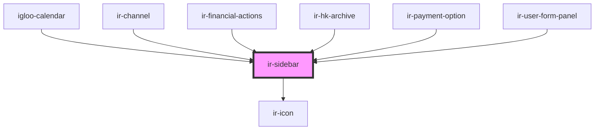

# ir-sidebar


<!-- Auto Generated Below -->


## Properties

| Property          | Attribute           | Description                                                                                                                    | Type                  | Default     |
| ----------------- | ------------------- | ------------------------------------------------------------------------------------------------------------------------------ | --------------------- | ----------- |
| `label`           | `label`             | Label text displayed in the sidebar header.                                                                                    | `string`              | `undefined` |
| `name`            | `name`              | Identifier for the sidebar instance.                                                                                           | `string`              | `undefined` |
| `open`            | `open`              | Whether the sidebar is open. Can be used with two-way binding.                                                                 | `boolean`             | `false`     |
| `preventClose`    | `prevent-close`     | Prevents the sidebar from closing when `toggleSidebar()` is called. When true, emits `beforeSidebarClose` instead of toggling. | `boolean`             | `undefined` |
| `showCloseButton` | `show-close-button` | Whether to show the close (X) button in the sidebar header.                                                                    | `boolean`             | `true`      |
| `side`            | `side`              | Which side of the screen the sidebar appears on. Options: `'left'` or `'right'`.                                               | `"left" \| "right"`   | `'right'`   |
| `sidebarStyles`   | --                  | Inline styles applied to the sidebar container.                                                                                | `CSSStyleDeclaration` | `undefined` |


## Events

| Event                | Description                                                                                      | Type               |
| -------------------- | ------------------------------------------------------------------------------------------------ | ------------------ |
| `beforeSidebarClose` | Event emitted *before* the sidebar attempts to close, but only if `preventClose` is set to true. | `CustomEvent<any>` |
| `irSidebarToggle`    | Event emitted when the sidebar is toggled open/closed. Emits the current `open` state.           | `CustomEvent<any>` |


## Methods

### `toggleSidebar() => Promise<void>`

Toggles the sidebar's visibility.

- If `preventClose` is true, emits `beforeSidebarClose` and does nothing else.
- Otherwise, emits `irSidebarToggle` with the current `open` state.

Example:
```ts
const el = document.querySelector('ir-sidebar');
await el.toggleSidebar();
```

#### Returns

Type: `Promise<void>`


## Dependencies

### Used by

 - [igloo-calendar](../../igloo-calendar)
 - [ir-channel](../../ir-channel)
 - [ir-financial-actions](../../ir-financial-actions)
 - [ir-hk-archive](../../ir-housekeeping/ir-hk-tasks/ir-hk-archive)
 - [ir-payment-option](../../ir-payment-option)
 - [ir-user-form-panel](../../ir-user-management/ir-user-form-panel)

### Depends on

- [ir-icon](../ir-icon)

### Graph


----------------------------------------------

*Built with [StencilJS](https://stenciljs.com/)*
