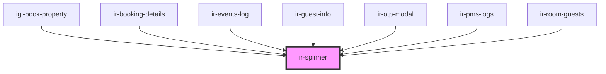

# ir-spinner

<!-- Auto Generated Below -->

## Properties

| Property      | Attribute      | Description | Type            | Default     |
| ------------- | -------------- | ----------- | --------------- | ----------- |
| `borderWidth` | `border-width` |             | `number`        | `undefined` |
| `color`       | `color`        |             | `string`        | `undefined` |
| `size`        | `size`         |             | `number`        | `undefined` |
| `unit`        | `unit`         |             | `"px" \| "rem"` | `'rem'`     |

## Dependencies

### Used by

 - [igl-book-property](../../igloo-calendar/igl-book-property)
 - [ir-booking-details](../../ir-booking-details)
 - [ir-events-log](../../ir-booking-details/ir-booking-header/events-log)
 - [ir-guest-info](../../ir-guest-info)
 - [ir-otp-modal](../../ir-otp-modal)
 - [ir-pms-logs](../../ir-booking-details/ir-booking-header/ir-pms-logs)
 - [ir-room-guests](../../ir-booking-details/ir-room-guests)

### Graph

----------------------------------------------

*Built with [StencilJS](https://stenciljs.com/)*
