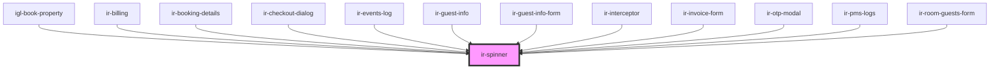

# ir-spinner

<!-- Auto Generated Below -->

## Properties

| Property      | Attribute      | Description                                                                                           | Type            | Default     |
| ------------- | -------------- | ----------------------------------------------------------------------------------------------------- | --------------- | ----------- |
| `borderWidth` | `border-width` | Thickness of the spinner's border. Example: `borderWidth={4}` renders a `4px` or `4rem` thick border. | `number`        | `undefined` |
| `color`       | `color`        | Color of the spinner. Accepts any valid CSS color string.                                             | `string`        | `undefined` |
| `size`        | `size`         | Size of the spinner (diameter). Example: `size={2}` with `unit="rem"` sets spinner to `2rem`.         | `number`        | `undefined` |
| `unit`        | `unit`         | CSS unit used for `size` and `borderWidth`. Can be `'px'` or `'rem'`.                                 | `"px" \| "rem"` | `'rem'`     |

## Dependencies

### Used by

 - [igl-book-property](../../igloo-calendar/igl-book-property)
 - [ir-billing](../../ir-billing)
 - [ir-booking-details](../../ir-booking-details)
 - [ir-checkout-dialog](../../ir-checkout-dialog)
 - [ir-events-log](../../ir-booking-details/ir-booking-header/events-log)
 - [ir-guest-info](../../ir-guest-info)
 - [ir-guest-info-form](../../ir-guest-info/ir-guest-info-form)
 - [ir-interceptor](../../ir-interceptor)
 - [ir-invoice-form](../../ir-invoice/ir-invoice-form)
 - [ir-otp-modal](../../ir-otp-modal)
 - [ir-pms-logs](../../ir-booking-details/ir-booking-header/ir-pms-logs)
 - [ir-room-guests-form](../../ir-booking-details/ir-room-guests/ir-room-guests-form)

### Graph

----------------------------------------------

*Built with [StencilJS](https://stenciljs.com/)*
