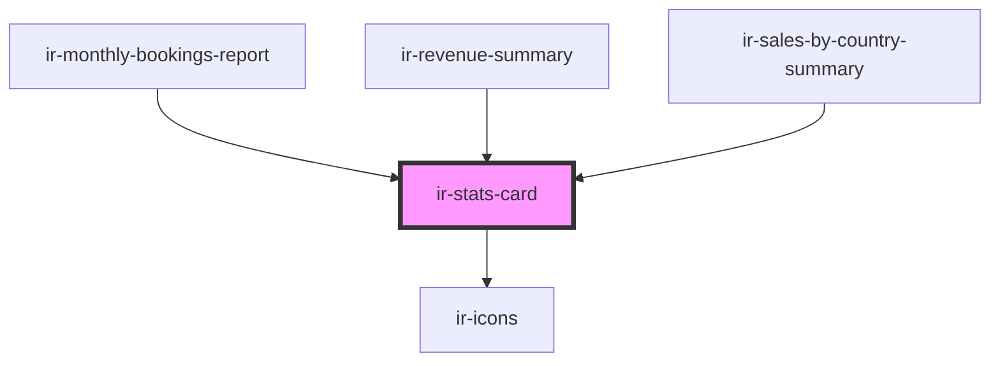

# ir-stats-card

<!-- Auto Generated Below -->

## Properties

| Property    | Attribute    | Description | Type                                                                                                                                                                                                                                                                                                                                                                                                                                                                                                                                                                                                                                                                                                                                                                                                                                                                              | Default     |
| ----------- | ------------ | ----------- | --------------------------------------------------------------------------------------------------------------------------------------------------------------------------------------------------------------------------------------------------------------------------------------------------------------------------------------------------------------------------------------------------------------------------------------------------------------------------------------------------------------------------------------------------------------------------------------------------------------------------------------------------------------------------------------------------------------------------------------------------------------------------------------------------------------------------------------------------------------------------------- | ----------- |
| `cardTitle` | `card-title` |             | `string`                                                                                                                                                                                                                                                                                                                                                                                                                                                                                                                                                                                                                                                                                                                                                                                                                                                                          | `undefined` |
| `icon`      | `icon`       |             | `"angle-down" \| "clock" \| "check" \| "heart-fill" \| "envelope-circle-check" \| "danger" \| "bell" \| "burger_menu" \| "home" \| "xmark" \| "minus" \| "user" \| "heart" \| "user_group" \| "search" \| "arrow_right" \| "arrow_left" \| "circle_info" \| "calendar" \| "xmark-fill" \| "globe" \| "facebook" \| "twitter" \| "whatsapp" \| "instagram" \| "youtube" \| "angle_left" \| "circle_check" \| "eraser" \| "file" \| "edit" \| "trash" \| "plus" \| "reciept" \| "print" \| "menu_list" \| "save" \| "credit_card" \| "closed_eye" \| "open_eye" \| "server" \| "double_caret_left" \| "square_plus" \| "angles_left" \| "angle_right" \| "angles_right" \| "outline_user" \| "key" \| "unlock" \| "circle_plus" \| "arrow-right-from-bracket" \| "note" \| "email" \| "calendar-xmark" \| "arrow-trend-up" \| "hotel" \| "arrow-trend-down" \| "angle-up" \| "ban"` | `undefined` |
| `subtitle`  | `subtitle`   |             | `string`                                                                                                                                                                                                                                                                                                                                                                                                                                                                                                                                                                                                                                                                                                                                                                                                                                                                          | `undefined` |
| `value`     | `value`      |             | `string`                                                                                                                                                                                                                                                                                                                                                                                                                                                                                                                                                                                                                                                                                                                                                                                                                                                                          | `undefined` |

## Dependencies

### Used by

 - [ir-monthly-bookings-report](../../ir-monthly-bookings-report)
 - [ir-revenue-summary](../../ir-daily-revenue/ir-revenue-summary)
 - [ir-sales-by-country-summary](../../ir-sales-by-country/ir-sales-by-country-summary)

### Depends on

- [ir-icons](../ir-icons)

### Graph

----------------------------------------------

*Built with [StencilJS](https://stenciljs.com/)*
