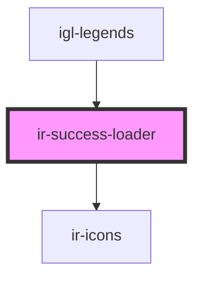

# ir-success-loader

<!-- Auto Generated Below -->

## Properties

| Property          | Attribute          | Description                                                                                                                      | Type      | Default |
| ----------------- | ------------------ | -------------------------------------------------------------------------------------------------------------------------------- | --------- | ------- |
| `active`          | `active`           | Controls the visibility of the loader. Setting this to `true` starts the spinner/success cycle.                                  | `boolean` | `true`  |
| `autoStart`       | `auto-start`       | Whether the loader should automatically start its cycle when it becomes active.                                                  | `boolean` | `true`  |
| `spinnerDuration` | `spinner-duration` | How long the spinner should be shown before transitioning to the success icon. Value is expressed in milliseconds.               | `number`  | `1500`  |
| `successDuration` | `success-duration` | How long the success icon should be shown before the loader dispatches the completion event. Value is expressed in milliseconds. | `number`  | `1000`  |

## Events

| Event            | Description                                                                         | Type                |
| ---------------- | ----------------------------------------------------------------------------------- | ------------------- |
| `loaderComplete` | Emit when the loader finishes the success state and should be hidden by the parent. | `CustomEvent<void>` |

## Shadow Parts

| Part        | Description |
| ----------- | ----------- |
| `"check"`   |             |
| `"spinner"` |             |

## Dependencies

### Used by

 - [igl-legends](../../igloo-calendar/igl-legends)

### Depends on

- [ir-icons](../ir-icons)

### Graph

----------------------------------------------

*Built with [StencilJS](https://stenciljs.com/)*
