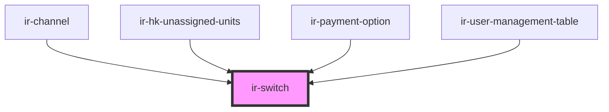

# ir-switch


<!-- Auto Generated Below -->


## Properties

| Property   | Attribute   | Description                                                                                  | Type      | Default     |
| ---------- | ----------- | -------------------------------------------------------------------------------------------- | --------- | ----------- |
| `checked`  | `checked`   | Whether the switch is currently checked (on). This is mutable and can be toggled internally. | `boolean` | `false`     |
| `disabled` | `disabled`  | Disables the switch if true.                                                                 | `boolean` | `false`     |
| `switchId` | `switch-id` | Optional ID for the switch. If not provided, a random ID will be generated.                  | `string`  | `undefined` |


## Events

| Event         | Description                                                                                                                                                                   | Type                   |
| ------------- | ----------------------------------------------------------------------------------------------------------------------------------------------------------------------------- | ---------------------- |
| `checkChange` | Emitted when the checked state changes. Emits `true` when turned on, `false` when turned off.  Example: ```tsx <ir-switch onCheckChange={(e) => console.log(e.detail)} /> ``` | `CustomEvent<boolean>` |


## Dependencies

### Used by

 - [ir-channel](../../ir-channel)
 - [ir-hk-unassigned-units](../../ir-housekeeping/ir-hk-unassigned-units)
 - [ir-payment-option](../../ir-payment-option)
 - [ir-user-management-table](../../ir-user-management/ir-user-management-table)

### Graph


----------------------------------------------

*Built with [StencilJS](https://stenciljs.com/)*
