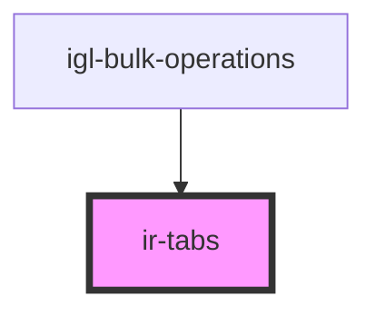

# ir-tabs

<!-- Auto Generated Below -->

## Properties

| Property     | Attribute     | Description                                     | Type      | Default     |
| ------------ | ------------- | ----------------------------------------------- | --------- | ----------- |
| `ariaLabel`  | `aria-label`  | Aria label for the tab list                     | `string`  | `'Tabs'`    |
| `disabled`   | `disabled`    | Whether the tabs are disabled                   | `boolean` | `false`     |
| `initialTab` | `initial-tab` | ID of the tab that should be selected initially | `string`  | `undefined` |
| `tabs`       | --            | Array of tab objects containing id and label    | `Tab[]`   | `[]`        |

## Events

| Event        | Description                    | Type                                          |
| ------------ | ------------------------------ | --------------------------------------------- |
| `tabChanged` | Emitted when a tab is selected | `CustomEvent<{ id: string; label: string; }>` |

## Dependencies

### Used by

 - [igl-bulk-operations](../../igloo-calendar/igl-bulk-operations)

### Graph

----------------------------------------------

*Built with [StencilJS](https://stenciljs.com/)*
