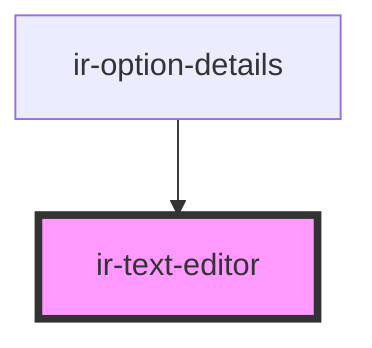

# ir-text-editor

<!-- Auto Generated Below -->

## Properties

| Property           | Attribute            | Description | Type                              | Default     |
| ------------------ | -------------------- | ----------- | --------------------------------- | ----------- |
| `error`            | `error`              |             | `boolean`                         | `undefined` |
| `placeholder`      | `placeholder`        |             | `string`                          | `undefined` |
| `plugins`          | --                   |             | `(string \| PluginConstructor)[]` | `[]`        |
| `pluginsMode`      | `plugins-mode`       |             | `"add" \| "replace"`              | `'add'`     |
| `toolbarItems`     | --                   |             | `ToolbarConfigItem[]`             | `[]`        |
| `toolbarItemsMode` | `toolbar-items-mode` |             | `"add" \| "replace"`              | `'add'`     |
| `value`            | `value`              |             | `string`                          | `undefined` |

## Events

| Event        | Description | Type                  |
| ------------ | ----------- | --------------------- |
| `textChange` |             | `CustomEvent<string>` |

## Dependencies

### Used by

 - [ir-option-details](../../ir-payment-option/ir-option-details)

### Graph

----------------------------------------------

*Built with [StencilJS](https://stenciljs.com/)*
