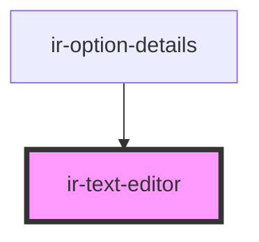

# ir-text-editor

<!-- Auto Generated Below -->

## Properties

| Property        | Attribute       | Description                                                                                                                                                    | Type            | Default     |
| --------------- | --------------- | -------------------------------------------------------------------------------------------------------------------------------------------------------------- | --------------- | ----------- |
| `error`         | `error`         |                                                                                                                                                                | `boolean`       | `undefined` |
| `maxLength`     | `max-length`    |                                                                                                                                                                | `number`        | `undefined` |
| `placeholder`   | `placeholder`   | Placeholder text                                                                                                                                               | `string`        | `undefined` |
| `readOnly`      | `read-only`     | If true, makes the editor read-only                                                                                                                            | `boolean`       | `false`     |
| `toolbarConfig` | --              | Type-safe toolbar configuration. For example, you can pass:  {   bold: true,   italic: true,   underline: true,   strike: false,   link: true,   clean: true } | `ToolbarConfig` | `undefined` |
| `userCanEdit`   | `user-can-edit` | Determines if the current user can edit the content                                                                                                            | `boolean`       | `true`      |
| `value`         | `value`         | Initial HTML content                                                                                                                                           | `string`        | `''`        |

## Events

| Event        | Description                                    | Type                  |
| ------------ | ---------------------------------------------- | --------------------- |
| `textChange` | Emits current HTML content whenever it changes | `CustomEvent<string>` |

## Dependencies

### Used by

 - [ir-option-details](../../ir-payment-option/ir-option-details)

### Graph

----------------------------------------------

*Built with [StencilJS](https://stenciljs.com/)*
