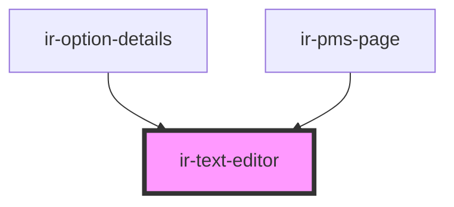

# ir-text-editor

<!-- Auto Generated Below -->

## Properties

| Property        | Attribute       | Description                                                                                                                                                                                                                                                                                 | Type                                                                  | Default      |
| --------------- | --------------- | ------------------------------------------------------------------------------------------------------------------------------------------------------------------------------------------------------------------------------------------------------------------------------------------- | --------------------------------------------------------------------- | ------------ |
| `appearance`    | `appearance`    |                                                                                                                                                                                                                                                                                             | `"filled" \| "filled-outlined" \| "outlined"`                         | `'outlined'` |
| `disabled`      | `disabled`      | Disables the editor.                                                                                                                                                                                                                                                                        | `boolean`                                                             | `false`      |
| `error`         | `error`         |                                                                                                                                                                                                                                                                                             | `boolean`                                                             | `undefined`  |
| `hint`          | `hint`          | The editor's hint. If you need to display HTML, use the `hint` slot instead.                                                                                                                                                                                                                | `string`                                                              | `undefined`  |
| `label`         | `label`         | The editor's label. If you need to display HTML, use the `label` slot instead.                                                                                                                                                                                                              | `string`                                                              | `undefined`  |
| `maxLength`     | `max-length`    |                                                                                                                                                                                                                                                                                             | `number`                                                              | `undefined`  |
| `name`          | `name`          | The name of the editor, submitted as a name/value pair with form data.                                                                                                                                                                                                                      | `string`                                                              | `undefined`  |
| `pill`          | `pill`          |                                                                                                                                                                                                                                                                                             | `boolean`                                                             | `false`      |
| `placeholder`   | `placeholder`   | Placeholder text                                                                                                                                                                                                                                                                            | `string`                                                              | `undefined`  |
| `readOnly`      | `read-only`     | If true, makes the editor read-only                                                                                                                                                                                                                                                         | `boolean`                                                             | `false`      |
| `required`      | `required`      | Makes the editor a required field for form submission.                                                                                                                                                                                                                                      | `boolean`                                                             | `false`      |
| `size`          | `size`          |                                                                                                                                                                                                                                                                                             | `"l" \| "large" \| "m" \| "medium" \| "s" \| "small" \| "xl" \| "xs"` | `'s'`        |
| `toolbarConfig` | --              | Type-safe toolbar configuration covering every Quill toolbar control. For example, you can pass:  {   bold: true,   italic: true,   underline: true,   strike: false,   header: true, // or e.g. [1, 2, false]   list: true, // or e.g. ['ordered', 'bullet']   link: true,   clean: true } | `ToolbarConfig`                                                       | `undefined`  |
| `userCanEdit`   | `user-can-edit` | Determines if the current user can edit the content                                                                                                                                                                                                                                         | `boolean`                                                             | `true`       |
| `value`         | `value`         | Initial HTML content                                                                                                                                                                                                                                                                        | `string`                                                              | `''`         |

## Events

| Event        | Description                                    | Type                  |
| ------------ | ---------------------------------------------- | --------------------- |
| `textChange` | Emits current HTML content whenever it changes | `CustomEvent<string>` |

## Methods

### `setFocus() => Promise<void>`

Moves focus into the editing area.

#### Returns

Type: `Promise<void>`

## Shadow Parts

| Part                   | Description |
| ---------------------- | ----------- |
| `"base"`               |             |
| `"form-control-label"` |             |
| `"hint"`               |             |
| `"label"`              |             |

## Dependencies

### Used by

 - [ir-option-details](../../ir-payment-option/ir-option-details)
 - [ir-pms-page](../../pms-header/ir-pms-page)

### Graph

```mermaid
graph TD;
  ir-option-details --> ir-text-editor
  ir-pms-page --> ir-text-editor
  style ir-text-editor fill:#f9f,stroke:#333,stroke-width:4px
```

----------------------------------------------

*Built with [StencilJS](https://stenciljs.com/)*
