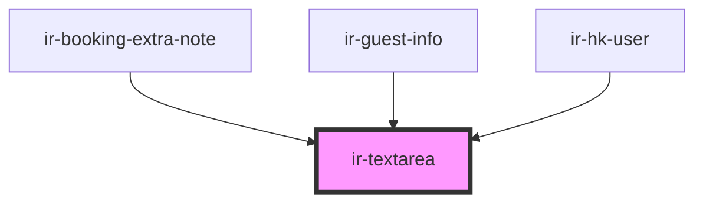

# ir-textarea


<!-- Auto Generated Below -->


## Properties

| Property            | Attribute            | Description                                                                                       | Type                                                    | Default           |
| ------------------- | -------------------- | ------------------------------------------------------------------------------------------------- | ------------------------------------------------------- | ----------------- |
| `cols`              | `cols`               | Number of visible character columns.                                                              | `number`                                                | `5`               |
| `label`             | `label`              | Text label displayed above or beside the textarea.                                                | `string`                                                | `'<label>'`       |
| `labelWidth`        | `label-width`        | Width of the label in grid columns (for `variant="prepend"`).                                     | `1 \| 10 \| 11 \| 2 \| 3 \| 4 \| 5 \| 6 \| 7 \| 8 \| 9` | `3`               |
| `maxLength`         | `max-length`         | Maximum number of characters allowed.                                                             | `number`                                                | `250`             |
| `placeholder`       | `placeholder`        | Placeholder text shown when input is empty.                                                       | `string`                                                | `'<placeholder>'` |
| `rows`              | `rows`               | Number of visible text lines.                                                                     | `number`                                                | `3`               |
| `styles`            | --                   | Inline styles applied directly to the textarea.                                                   | `{ [key: string]: string; }`                            | `undefined`       |
| `testId`            | `test-id`            | `data-testid` for targeting in tests.                                                             | `string`                                                | `undefined`       |
| `text`              | `text`               | Unused property, intended to store textarea text.                                                 | `string`                                                | `''`              |
| `textareaClassname` | `textarea-classname` | Additional classes for the textarea element.                                                      | `string`                                                | `undefined`       |
| `value`             | `value`              | Current value of the textarea (supports two-way binding).                                         | `string`                                                | `''`              |
| `variant`           | `variant`            | Layout style of the textarea: `'default'` shows label above, `'prepend'` shows label on the left. | `"default" \| "prepend"`                                | `'default'`       |


## Events

| Event        | Description                                                                                                               | Type                  |
| ------------ | ------------------------------------------------------------------------------------------------------------------------- | --------------------- |
| `textChange` | Emits when the textarea content changes.  Example: ```tsx <ir-textarea onTextChange={(e) => console.log(e.detail)} /> ``` | `CustomEvent<string>` |


## Dependencies

### Used by

 - [ir-booking-extra-note](../../ir-booking-details/ir-booking-extra-note)
 - [ir-guest-info](../../ir-guest-info)
 - [ir-hk-user](../../ir-housekeeping/ir-hk-user)

### Graph


----------------------------------------------

*Built with [StencilJS](https://stenciljs.com/)*
