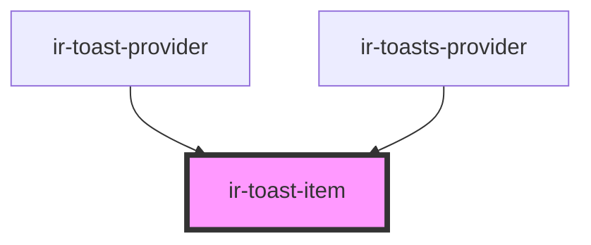

# ir-toast-item

<!-- Auto Generated Below -->

## Properties

| Property      | Attribute     | Description                                                                        | Type                                                         | Default     |
| ------------- | ------------- | ---------------------------------------------------------------------------------- | ------------------------------------------------------------ | ----------- |
| `dismissible` | `dismissible` | Whether the close button is rendered.                                              | `boolean`                                                    | `true`      |
| `duration`    | `duration`    | Auto-dismiss delay in milliseconds. Pass `0` or `Infinity` for a persistent toast. | `number`                                                     | `5000`      |
| `variant`     | `variant`     |                                                                                    | `"brand" \| "danger" \| "neutral" \| "success" \| "warning"` | `'neutral'` |

## Events

| Event       | Description                                                                            | Type                |
| ----------- | -------------------------------------------------------------------------------------- | ------------------- |
| `irDismiss` | Emitted once the exit animation finishes and the toast should be removed from the DOM. | `CustomEvent<void>` |

## Methods

### `hide() => Promise<void>`

Plays the exit animation, then emits `irDismiss`.

#### Returns

Type: `Promise<void>`

### `startTimer() => Promise<void>`

Starts the auto-dismiss countdown. Safe to call more than once.

#### Returns

Type: `Promise<void>`

## Shadow Parts

| Part              | Description |
| ----------------- | ----------- |
| `"accent"`        |             |
| `"close-button"`  |             |
| `"close-icon"`    |             |
| `"content"`       |             |
| `"icon"`          |             |
| `"progress-ring"` |             |

## Dependencies

### Used by

 - [ir-toast-provider](../../ir-toast-provider)
 - [ir-toasts-provider](../ir-toasts-provider)

### Graph

----------------------------------------------

*Built with [StencilJS](https://stenciljs.com/)*
