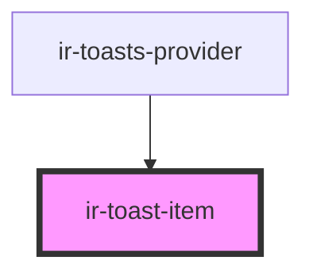

# ir-toast-item

<!-- Auto Generated Below -->

## Properties

| Property   | Attribute  | Description | Type                                                         | Default     |
| ---------- | ---------- | ----------- | ------------------------------------------------------------ | ----------- |
| `duration` | `duration` |             | `number`                                                     | `5000`      |
| `variant`  | `variant`  |             | `"brand" \| "danger" \| "neutral" \| "success" \| "warning"` | `'neutral'` |

## Events

| Event       | Description | Type                |
| ----------- | ----------- | ------------------- |
| `irDismiss` |             | `CustomEvent<void>` |

## Shadow Parts

| Part              | Description |
| ----------------- | ----------- |
| `"accent"`        |             |
| `"close-button"`  |             |
| `"close-icon"`    |             |
| `"content"`       |             |
| `"icon"`          |             |
| `"progress-ring"` |             |

## Dependencies

### Used by

 - [ir-toasts-provider](../ir-toasts-provider)

### Graph

----------------------------------------------

*Built with [StencilJS](https://stenciljs.com/)*
