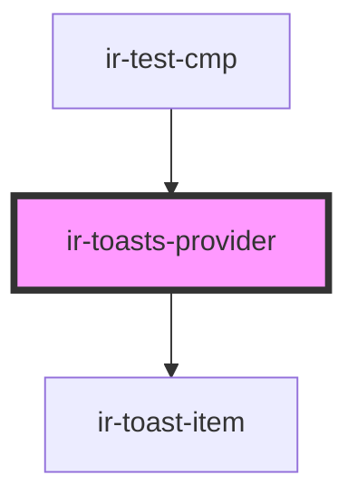

# ir-toasts-provider

<!-- Auto Generated Below -->

## Methods

### `create(message: string, options?: Partial<ToastOptions>) => Promise<string>`

Creates a toast and adds it to the stack. Returns the toast id.

#### Parameters

| Name      | Type                                                                                               | Description |
| --------- | -------------------------------------------------------------------------------------------------- | ----------- |
| `message` | `string`                                                                                           |             |
| `options` | `{ variant?: ToastVariants; duration?: number; allowHtml?: boolean; icon?: string \| ToastIcon; }` |             |

#### Returns

Type: `Promise<string>`

## Dependencies

### Used by

 - [ir-test-cmp](../../ir-test-cmp)

### Depends on

- [ir-toast-item](../ir-toast-item)

### Graph

----------------------------------------------

*Built with [StencilJS](https://stenciljs.com/)*
