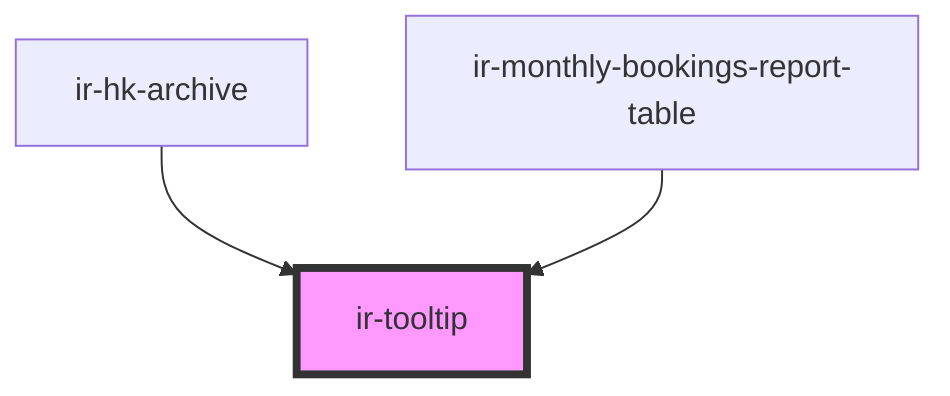

# ir-tooltip

<!-- Auto Generated Below -->

## Properties

| Property         | Attribute         | Description                                                                                                                                                                                                                                                                                                                                                                              | Type                           | Default     |
| ---------------- | ----------------- | ---------------------------------------------------------------------------------------------------------------------------------------------------------------------------------------------------------------------------------------------------------------------------------------------------------------------------------------------------------------------------------------- | ------------------------------ | ----------- |
| `alignment`      | `alignment`       | Defines the horizontal alignment of the tooltip trigger content.  - `'start'`: Aligns the trigger to the left within its container. - `'center'`: Centers the trigger horizontally (default). - `'end'`: Aligns the trigger to the right within its container.  This alignment affects how the trigger (e.g., icon or slotted element) is positioned inside the outer tooltip container. | `"center" \| "end" \| "start"` | `'center'`  |
| `containerClass` | `container-class` | CSS classes applied to the outer tooltip container.                                                                                                                                                                                                                                                                                                                                      | `string`                       | `undefined` |
| `containerStyle` | --                | Inline styles applied to the outer tooltip container.                                                                                                                                                                                                                                                                                                                                    | `{ [key: string]: string; }`   | `undefined` |
| `customSlot`     | `custom-slot`     | When true, allows a custom element to trigger the tooltip using a named slot. If false, a default info icon is used.                                                                                                                                                                                                                                                                     | `boolean`                      | `false`     |
| `message`        | `message`         | Text or HTML content to be displayed in the tooltip.                                                                                                                                                                                                                                                                                                                                     | `string`                       | `undefined` |
| `withHtml`       | `with-html`       | Whether the tooltip content should be rendered using `innerHTML`. If false, treats message as plain text.                                                                                                                                                                                                                                                                                | `boolean`                      | `true`      |

## Dependencies

### Used by

 - [ir-hk-archive](../../ir-housekeeping/ir-hk-tasks/ir-hk-archive)
 - [ir-monthly-bookings-report-table](../../ir-monthly-bookings-report/ir-monthly-bookings-report-table)

### Graph

----------------------------------------------

*Built with [StencilJS](https://stenciljs.com/)*
