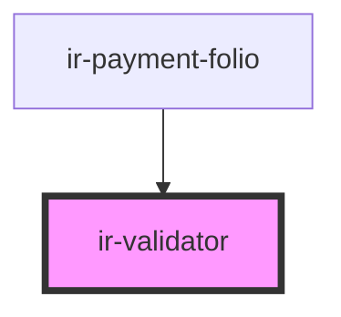

# ir-validator

<!-- Auto Generated Below -->

## Properties

| Property              | Attribute             | Description                                                                  | Type                     | Default                                           |
| --------------------- | --------------------- | ---------------------------------------------------------------------------- | ------------------------ | ------------------------------------------------- |
| `autovalidate`        | `autovalidate`        | Enables automatic validation on every value change.                          | `boolean`                | `undefined`                                       |
| `blurEvent`           | `blur-event`          | Event names (space/comma separated) dispatched when the child loses focus.   | `string`                 | `'blur input-blur select-blur'`                   |
| `form`                | `form`                | Optional form id. Falls back to the closest ancestor form when omitted.      | `string`                 | `undefined`                                       |
| `schema` _(required)_ | --                    | Zod schema used to validate the child control's value.                       | `ZodType<any, any, any>` | `undefined`                                       |
| `validationDebounce`  | `validation-debounce` | Debounce delay (ms) before running validation for autovalidated changes.     | `number`                 | `200`                                             |
| `value`               | `value`               |                                                                              | `any`                    | `undefined`                                       |
| `valueEvent`          | `value-event`         | Event names (space/comma separated) dispatched when the child value changes. | `string`                 | `'input input-change value-change select-change'` |

## Events

| Event                | Description                                  | Type                                               |
| -------------------- | -------------------------------------------- | -------------------------------------------------- |
| `irValidationChange` | Emits whenever the validation state toggles. | `CustomEvent<{ valid: boolean; value: unknown; }>` |
| `irValueChange`      | Emits whenever the tracked value changes.    | `CustomEvent<{ value: unknown; }>`                 |

## Dependencies

### Used by

 - [ir-payment-folio](../../ir-booking-details/ir-payment-details/ir-payment-folio)

### Graph

----------------------------------------------

*Built with [StencilJS](https://stenciljs.com/)*
