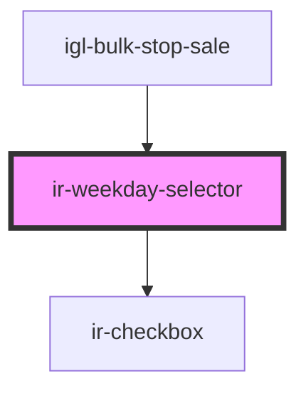

# ir-weekday-selector


<!-- Auto Generated Below -->


## Properties

| Property   | Attribute | Description                                         | Type       | Default |
| ---------- | --------- | --------------------------------------------------- | ---------- | ------- |
| `weekdays` | --        | Initial list of selected weekdays (numeric values). | `number[]` | `[]`    |


## Events

| Event           | Description                                                                                                                                                              | Type                    |
| --------------- | ------------------------------------------------------------------------------------------------------------------------------------------------------------------------ | ----------------------- |
| `weekdayChange` | Emits an updated list of selected weekday values when the selection changes.  Example: ```tsx <ir-weekday-selector onWeekdayChange={(e) => console.log(e.detail)} /> ``` | `CustomEvent<number[]>` |


## Dependencies

### Used by

 - [igl-bulk-stop-sale](../../igloo-calendar/igl-bulk-operations/igl-bulk-stop-sale)

### Depends on

- [ir-checkbox](../ir-checkbox)

### Graph


----------------------------------------------

*Built with [StencilJS](https://stenciljs.com/)*
