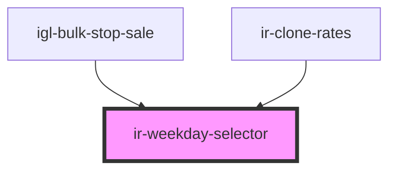

# ir-weekday-selector


<!-- Auto Generated Below -->


## Properties

| Property   | Attribute  | Description                                                                                                                   | Type       | Default |
| ---------- | ---------- | ----------------------------------------------------------------------------------------------------------------------------- | ---------- | ------- |
| `required` | `required` | When true, at least one weekday must stay selected: the last remaining selected weekday is disabled so it can't be unchecked. | `boolean`  | `false` |
| `weekdays` | --         | Initial list of selected weekdays (numeric values).                                                                           | `number[]` | `[]`    |


## Events

| Event           | Description                                                                                                                                                              | Type                    |
| --------------- | ------------------------------------------------------------------------------------------------------------------------------------------------------------------------ | ----------------------- |
| `weekdayChange` | Emits an updated list of selected weekday values when the selection changes.  Example: ```tsx <ir-weekday-selector onWeekdayChange={(e) => console.log(e.detail)} /> ``` | `CustomEvent<number[]>` |


## Dependencies

### Used by

 - [igl-bulk-stop-sale](../../igloo-calendar/igl-bulk-operations/igl-bulk-stop-sale)
 - [ir-clone-rates](../../ir-clone-rates)

### Graph

```mermaid
graph TD;
  igl-bulk-stop-sale --> ir-weekday-selector
  ir-clone-rates --> ir-weekday-selector
  style ir-weekday-selector fill:#f9f,stroke:#333,stroke-width:4px
```

----------------------------------------------

*Built with [StencilJS](https://stenciljs.com/)*
