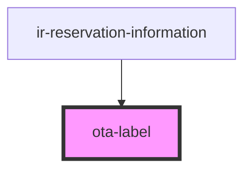

# ota-label

<!-- Auto Generated Below -->

## Properties

| Property          | Attribute           | Description                                                                 | Type          | Default     |
| ----------------- | ------------------- | --------------------------------------------------------------------------- | ------------- | ----------- |
| `label`           | `label`             | Label displayed as the section title.                                       | `string`      | `undefined` |
| `maxVisibleItems` | `max-visible-items` | Maximum number of remarks to display before showing the "Show More" button. | `number`      | `3`         |
| `remarks`         | --                  | Array of OTA notes to display in the list.                                  | `IOtaNotes[]` | `undefined` |

## Dependencies

### Used by

 - [ir-reservation-information](../../ir-booking-details/ir-reservation-information)

### Graph

----------------------------------------------

*Built with [StencilJS](https://stenciljs.com/)*
